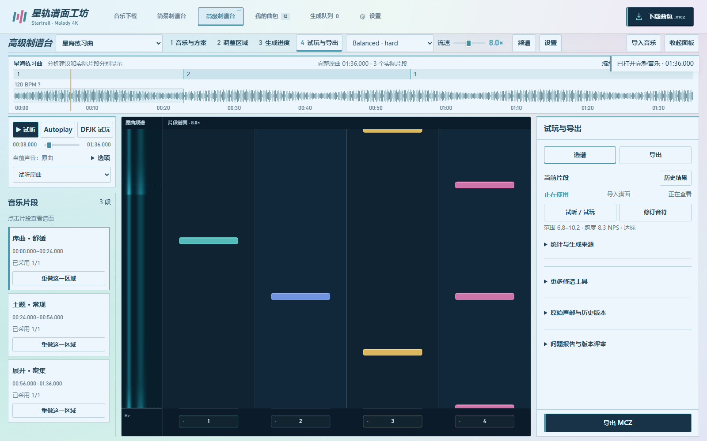
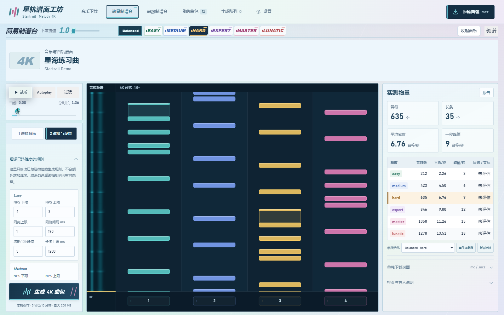
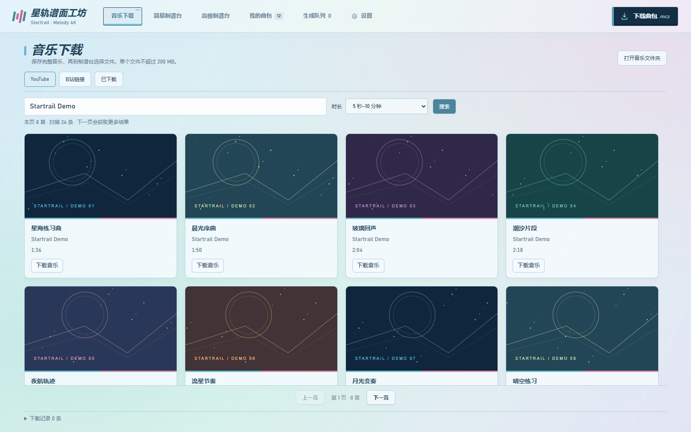
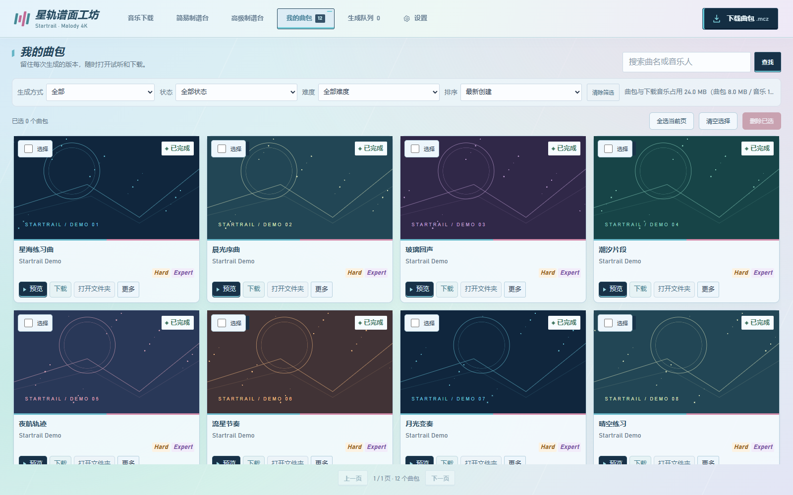
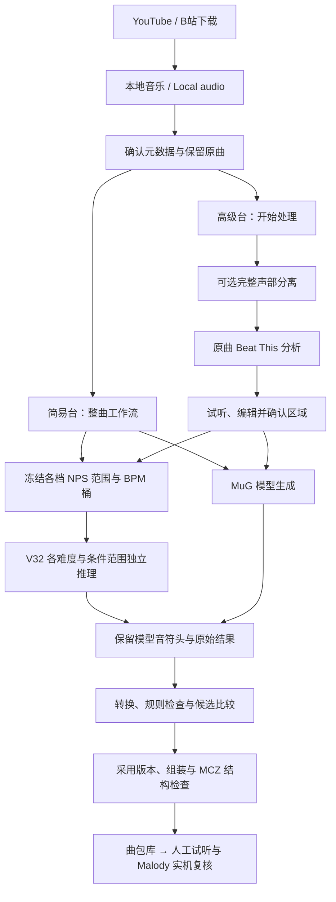

# 星轨谱面工坊 · Startrail

<div align="center">
  
  <h1>STARTRAIL · MALODY CHART FORGE</h1>
  <p><strong>从音乐到四轨：本地生成、分段编排、试听比较和 MCZ 导出。</strong><br>Local 4K generation, region planning, synchronized review and MCZ export.</p>
  <p>
    
    
    
  </p>
  <p><a href="#简体中文">简体中文</a> · <a href="#english">English</a> · <a href="#快速开始">快速开始</a> · <a href="CHANGELOG.md">Release notes</a> · <a href="https://github.com/DokiDokiYuyuko/Malody-Chart-Forge/tree/v1">v1 archive</a></p>
</div>



| 简易制谱台 · Simple studio | 音乐下载 · Music downloads |
| --- | --- |
|  |  |



截图使用当前桌面界面与合成演示数据，不包含用户音乐、账号、个人署名或真实任务记录；演示音符不代表模型生成质量。 Screenshots show the current desktop UI with synthetic demo data, not personal libraries or evidence of model quality.

<a id="简体中文"></a>
## 简体中文

Startrail 是面向 **Windows 电脑端、经典 Malody 4K** 的本地制谱工具。简易台适合整曲生成；高级台提供音轨准备、区域规划、逐区域重做、A/B 候选和成品组装。当前维护范围为电脑端。

`main` 包含当前工作流；`v1` 保留此前 GitHub 版本。新主分支公开运行代码、必要模型配置、测试和使用说明。音乐、生成曲包、密钥、Cookie、实验数据和内部开发报告留在本机。

### 新版功能

| 工作区 | 可以做什么 |
| --- | --- |
| 音乐下载 | 搜索 YouTube、解析 B站视频链接，核对曲名和音乐人后保存原格式音轨；下载与制谱分别提交。 |
| 简易制谱台 | 选择本地音乐、排键和六档难度，整曲生成后试听、Autoplay、DFJK 试玩及导出。 |
| 高级制谱台 | 准备完整音轨，分析原曲，试听区域方案，调整边界、合并区域或改变强弱，再确认生成。 |
| 分离与比较 | Demucs 快速分离、Kim Mel-Band RoFormer 质量档；局部试分离、同位置 A/B 与完整人声／伴奏输入。 |
| 候选与历史 | 原始模型结果、修订候选和采用版分别保存；局部重做后选择「采用新版」或「保留原版」。 |
| 曲包库与队列 | 普通／高级成品统一分页、搜索、预览、下载、打开文件夹及多选删除；队列显示准备、分析、生成与完成记录。 |
| 试听与试玩 | 波形、频谱与四轨共享时钟；试听和试玩互斥，支持跳转、暂停、重试与内嵌结算。 |
| 外观与署名 | 五套主题、可关闭的鼠标流星、谱师名字设置；署名传递到新谱面与导出包。 |
| 可选 Agent 修谱 | 配置自己的修谱／听音 API，针对有限窗口提交证据与修订，比较后手动采用。 |

### 生成流水线



**新版 V32 使用每档 NPS 上下限。** 提交时冻结 Beat This BPM 桶、版本化 NPS→SR 曲线和条件；不同难度及条件范围分别推理。BPM 桶用于生成条件，自动分析结果不默认作为强制 V32 timing 参考。历史任务重试沿用原来冻结的路线。

音符只来自模型生成的音符头。声音证据用于核对现有音符、长条持续声和保守的共同起音对齐，不用于补音符或凑多押。确认的错开节奏应保留。密度是否落在目标范围、音乐是否准确、实际手感是否合适，是三个不同问题。

### 快速开始

需要 **Windows 10/11 x64、Python 3.12 x64 和 Git for Windows**。V32 需要兼容锁文件中 CUDA 13.0 PyTorch wheel 的 NVIDIA GPU 与驱动。主环境使用 PyTorch 2.5.1 + CUDA 12.4，V32 使用隔离的 PyTorch 2.10.0 + CUDA 13.0；依赖以仓库锁文件为准。模型和环境会占用数十 GB，另需为音乐与曲包预留空间。

```powershell
git clone --recurse-submodules https://github.com/DokiDokiYuyuko/Malody-Chart-Forge.git
cd Malody-Chart-Forge
```

1. 双击 **`一键配置环境.bat`**，选择 MuG、V32 或两者。按提示填写可选镜像、Hugging Face 端点和代理；留空使用默认配置。脚本使用锁文件并下载、校验所选模型，MuG 下载前需确认上游使用条款。
2. **新版 V32 与高级台还需要 Beat This 分析环境**，在 PowerShell 执行：

   ```powershell
   .\.venv\Scripts\python.exe tools\setup_beat_analysis.py
   ```

3. 双击 **`启动制谱台.bat`**，或运行 `powershell -NoProfile -ExecutionPolicy Bypass -File .\start.ps1`。启动器会打开本机网页，通常是 `http://127.0.0.1:8765`。初始化时 CMD 可能暂时没有进度文字；错误日志在 `logs/server.stderr.log`。已有旧版服务时，按启动器提示关闭旧服务再启动。

只使用简易台 MuG 时，可跳过 Beat This。缺少对应环境或权重时，相关功能会明确报告不可用。启动器只绑定 localhost。

已有克隆请先保存本地修改，然后更新 `main` 并执行 `git submodule update --init --recursive`；现有用户数据应保留在原目录。旧版本可从 [`v1`](https://github.com/DokiDokiYuyuko/Malody-Chart-Forge/tree/v1) 单独克隆或检出，不要在有未保存工作时直接切换。

<details>
<summary>手动安装与可选组件</summary>

主环境与 MuG：

```powershell
py -3.12 -m venv .venv
.\.venv\Scripts\python.exe -m pip install -r requirements-lock.txt
.\.venv\Scripts\python.exe tools\download_file.py https://huggingface.co/ayousanz/Mug-Diffusion-model/resolve/main/model.ckpt models\mug-diffusion\v1.0.0\model.ckpt --workers 4 --sha256 af6ab91337d0ef6b518367082ac3f849448c6daaa01fd987678fb25ea44ca184
.\.venv\Scripts\python.exe tools\validate_mug_install.py
```

V32：

```powershell
py -3.12 -m venv runtime\mapperatorinator-venv
.\runtime\mapperatorinator-venv\Scripts\python.exe -m pip install -r runtime\mapperatorinator-requirements-lock.txt
.\.venv\Scripts\python.exe tools\download_mapperatorinator.py
.\.venv\Scripts\python.exe tools\download_mapperatorinator.py --base
.\runtime\mapperatorinator-venv\Scripts\python.exe tools\validate_v32_install.py
.\.venv\Scripts\python.exe tools\setup_beat_analysis.py
```

可选声部分离，分别使用独立环境：

```powershell
powershell -NoProfile -ExecutionPolicy Bypass -File tools\setup_separation.ps1
powershell -NoProfile -ExecutionPolicy Bypass -File tools\setup_roformer.ps1
```

一键配置会尝试安装 yt-dlp；在线下载需要网络。**`一键连接YouTube.bat`** 使用专用 Edge 登录窗口，把明确选择导入的登录 Cookie 保存在被忽略的 `private/` 中，不使用日常浏览器个人资料。此可选入口需要 Node.js 与 Microsoft Edge；普通公开音源先尝试匿名下载。也可参考 `runtime/music-source-settings.example.json` 配置本地 Cookie 文件。不要上传 Cookie、登录目录或实际设置文件。

模型版本和公开校验值见 [`models/README.md`](models/README.md)。

</details>

### 两种制谱方式

**简易台：** 先从本地选择音乐，核对曲名、音乐人和谱师，选择排键与难度。V32 每档填写 NPS 范围；生成后通过难度标签切换预览，用试听、Autoplay 或 DFJK 试玩检查结果，再下载 MCZ。单档迭代会保留新旧版本；实际是否复用模型缓存或再次推理取决于任务冻结的生成路线。

**高级台：** 导入音频或 MCZ，选择难度、排键与原曲／声部输入，点击 **「开始处理」**。试听建议的舒缓／常规／密集区域，可以改变划分粗细、拖动边界、合并或调整强弱，再点击 **「确认方案并生成」**。导入和切换声部本身不会启动处理。

合格结果可填充空白区域；已有采用版的区域保留原选择。局部重做后同位置比较 A/B，明确选择新版或原版。失败区域有独立重试入口。设置中提供多组合、模型参数、种子、BPM 桶、精确规则和手动 timing。自动检测不是可靠节拍真值；显式确认的手动参考另行处理。

导出检查全部选定组合并复用或建立新成品。主动排除的区域同时移除对应音乐和音符；准备时间、接缝和长条处理写入报告。包内采用经典 `0/` 路径、UTF-8 MC 和 OGG Vorbis 音轨。

### 下载、队列与曲包库

- YouTube 每页最多 24 条有效结果，按视频 ID 去重；下一页继续搜索，上一页复用已载入结果。B站使用视频链接、BV 号或分享短链解析，第三方解析服务的可用性可能影响结果。
- 下载前核对名称，源音轨按实际格式保存；下载不会自动分析或排队制谱。成品音轨另转为 OGG Vorbis，不自动降噪。
- 普通与高级成品统一保存在 `outputs/曲包/<曲名>/<时间-短编号>/`，包含 MCZ、`report.json` 和 `manifest.json`。
- 曲包库每页 12 条，支持搜索、类型筛选、单删和跨页多选；全选仅当前页。删除交付副本会保留原任务、音乐和采用版本。
- 重启后等待任务暂停，需要手动继续；中断任务可重试。默认串行；通过当前设备硬件基准后，才开放最多两路任务并行。V32 内部推理流设置与队列任务并行是不同配置。
- 默认只裁除末尾连续至少 1 秒、所有声道完全为零的 PCM。微弱混响、前奏和中途静音保留；可选择保留片尾，原始音乐始终保留。

### 数据、隐私与质量范围

| 目录 | 内容 |
| --- | --- |
| `malody_studio/`, `web/`, `tools/` | 应用、桌面网页和运行工具 |
| `models/`, `runtime/`, `vendor/` | 公开配置、独立环境和固定上游源码；权重另下载 |
| `data/calibrations/`, `util/nps_star_mapping/` | 运行必需的汇总校准曲线与查询代码，包含版本和哈希 |
| `data/音乐/`, `uploads/` | 本地音源，Git 忽略 |
| `outputs/`, `cache/`, `logs/`, `private/` | 曲包、候选、缓存、日志和私密配置，Git 忽略 |

本地推理不发送音频到云端。在线搜索／下载会访问对应平台；可选 Agent 仅在用户启动评审后向所配置服务发送窗口证据，音频片段可单独开关。持久 API 密钥可使用 Windows 用户加密保存。

NPS 曲线从 `1 ≤ SR < 7` 的样本拟合，**SR ≥ 7 完全来自低星趋势外推**。曲线描述统计关系，不保证模型输出落在目标范围。未达到密度目标应报告不足，不能加音符伪装达标。未解决或回滚的对齐组仍需要人工核验。

自动化测试与 MCZ 结构检查不能证明音乐准确、实际 Malody 导入成功或人工手感通过。请在分享前实际试听、导入和试玩。

### 自动化检查

```powershell
.\.venv\Scripts\python.exe -m pytest -q
node --test tests/*.cjs tests/*.js
```

部分浏览器与模型集成测试需要额外环境，缺少时会跳过。测试结果应与实际模型、听音和游戏验证分开解释。仓库不附带用户歌曲或生成曲包作为测试资源。

### 来源与许可

本项目为独立社区工具，与 Malody 及模型作者无隶属关系。仓库没有为整个应用声明根级许可证；各上游组件的许可不能自动扩展到整个应用。

- [MuG Diffusion](https://github.com/Keytoyze/Mug-Diffusion) / [权重来源](https://huggingface.co/ayousanz/Mug-Diffusion-model)：遵守上游对模型权重和生成谱面的非商业限制，并保留 AI 来源说明。
- [Mapperatorinator](https://github.com/OliBomby/Mapperatorinator) / [V32 固定版本](https://huggingface.co/OliBomby/Mapperatorinator-v32/tree/74f22583400d259bf424819e11027c17933efe54)：上游代码／模型声明以其 MIT 文件和模型卡为准。
- [Beat This](https://github.com/CPJKU/beat_this)、[Demucs](https://github.com/facebookresearch/demucs)、[RoFormer 推理来源](https://github.com/ZFTurbo/Music-Source-Separation-Training)：保留各组件原始许可；模型权重按各自来源条款使用。
- 音乐、封面和输入谱面由其权利人保留权利。下载、生成和打包不会授予转载、商业使用或分享权限。

---

<a id="english"></a>
## English

**Startrail · Malody Chart Forge** is a local authoring tool for **classic Malody 4K on Windows desktop**. The Simple studio provides a whole-song workflow. The Advanced studio adds full-length source preparation, region planning, independent regeneration, A/B candidates and package assembly.

`main` contains the current workflow. [`v1`](https://github.com/DokiDokiYuyuko/Malody-Chart-Forge/tree/v1) preserves the previous GitHub version. The public tree contains application code, required configuration, tests and user documentation. Personal music, generated packages, credentials, research outputs and internal development reports stay local.

### What changed

- **Separate music downloads:** paginated YouTube search, Bilibili link resolution, metadata confirmation and original-format local audio. Downloading does not start analysis or chart generation.
- **Independent V32 targets:** each difficulty has an NPS minimum and maximum. Submissions freeze BPM buckets and the versioned NPS-to-SR calibration; difficulties and condition spans run independently. Historical retries retain their saved route.
- **Advanced region workflow:** import → Start processing → audition and edit suggested regions → Confirm plan and generate → review, redo or export. Adjust granularity, boundaries and intensity without repeating unchanged audio analysis.
- **Stems and A/B:** optional Demucs or Kim Mel-Band RoFormer, local trials, aligned listening and full vocal/accompaniment inputs. Original audio, raw model charts, candidates and adopted versions are preserved.
- **Synchronized desktop playback:** waveform, spectrum and four lanes share the playback clock. Preview and gameplay are mutually exclusive; Autoplay, DFJK practice, seek, pause and retry are embedded.
- **Unified library and history:** Simple and Advanced deliveries share search, pagination, preview, download, folder opening and multiple deletion. Preparation, analysis and generation have explicit queue states and retry actions.
- **Author and appearance settings:** configurable chart-author metadata, five palettes and optional meteor trails. Public defaults use the neutral name `Startrail`.
- **Optional Agent review:** use your own repair/listening API to propose bounded evidence-based changes, then compare and apply manually.

The [pipeline diagram](#生成流水线) shows both routes. New notes come from model-generated heads. Sound evidence may validate existing notes, sustain and conservative common-attack alignment; it does not fill an NPS quota. Confirmed staggered rhythms must remain intact. Density compliance, musical accuracy and game feel require separate evaluation.

### Install and start

Use Windows 10/11 x64, Python 3.12 x64 and Git for Windows. V32 requires an NVIDIA GPU and a driver compatible with the pinned CUDA 13.0 PyTorch wheel. The main environment uses PyTorch 2.5.1 + CUDA 12.4; V32 uses a separate PyTorch 2.10.0 + CUDA 13.0 environment. Use the supplied dependency locks and reserve space for several environments, weights, music and generated packages.

```powershell
git clone --recurse-submodules https://github.com/DokiDokiYuyuko/Malody-Chart-Forge.git
cd Malody-Chart-Forge
```

1. Run **`一键配置环境.bat`**, choose MuG, V32 or both, and enter optional mirror/proxy settings. It installs the locked environments, downloads and verifies selected weights, and checks the installation. Review MuG's upstream terms before downloading it.
2. **New V32 submissions and the Advanced studio require Beat This:**

   ```powershell
   .\.venv\Scripts\python.exe tools\setup_beat_analysis.py
   ```

3. Run **`启动制谱台.bat`** or `powershell -NoProfile -ExecutionPolicy Bypass -File .\start.ps1`. The launcher opens localhost, normally `http://127.0.0.1:8765`. Cold initialization can be silent; inspect `logs/server.stderr.log` if startup fails. An incompatible running service must be closed before restarting.

Simple MuG generation does not require Beat This. Missing environments or weights disable the related features. The [manual installation commands](#快速开始) and [`models/README.md`](models/README.md) cover individual components. Optional separation uses `tools/setup_separation.ps1` and `tools/setup_roformer.ps1` in isolated environments.

For existing clones, save local changes before updating `main`, then run `git submodule update --init --recursive`. Keep user data in its existing directories. Use a separate checkout to compare the archived `v1` branch.

Optional **`一键连接YouTube.bat`** requires Node.js and Microsoft Edge. It opens a dedicated login profile and saves explicitly imported cookies under ignored `private/`; it does not use the everyday browser profile. Public downloads try anonymous access first. Never commit cookies or the actual local music-source settings.

### Authoring and export

**Simple:** select local audio, confirm title, artist and chart author, choose patterns and difficulties, and set per-tier V32 NPS ranges. Review the completed result using difficulty tabs, listening, Autoplay or DFJK practice, then export. Iteration preserves chart versions; whether it reuses cached notes or runs the model again depends on the frozen task policy.

**Advanced:** import audio or MCZ, choose difficulty/pattern/source mode and click **Start processing**. Audition the calm/regular/dense region proposal, edit the plan and click **Confirm plan and generate**. Imports and source changes do not automatically start processing. Valid results fill empty regions; an existing adopted version stays selected. Redo a region, compare A/B at the same position and explicitly adopt or keep the original. Failed regions can be retried independently.

Settings expose multiple combinations, model parameters, seeds, BPM buckets, precise rules and manual timing. Beat This informs arrangement and generation conditions; automatic strong V32 timing references remain disabled. Explicitly confirmed manual references are handled separately.

Export checks selected combinations and creates or reuses a matching delivery. Excluding a region removes both its audio and notes. Preparation time, seams and hold adjustments are reported. Packages use classic `0/` paths, UTF-8 MC and OGG Vorbis audio.

### Library, data and evaluation

Deliveries live under `outputs/曲包/<title>/<timestamp-short-id>/` with MCZ, report and manifest files. The library shows 12 records per page. Select-all affects the current page; deleting delivery copies preserves source tasks, music and adopted charts. Waiting tasks pause after a restart and must be resumed. Queue jobs are serial by default; at most two concurrent jobs are enabled only after the current device passes its hardware benchmark. V32 internal inference streams are a separate setting.

Only exact multichannel zero PCM at the end, lasting at least one second, is trimmed by default. Reverb, quiet sounds, intros and interior silence remain. Original music is retained and tail preservation can be selected.

Local inference does not upload audio. Online search/download accesses the selected services. Optional Agent review sends window evidence only when requested; audio excerpts have a separate switch, and persistent API credentials can use Windows user encryption.

The calibration is fitted only from **`1 ≤ SR < 7`** samples. **SR ≥ 7 is extrapolated exclusively from lower-star trends.** This statistical mapping cannot guarantee generated NPS or official Malody difficulty. Underfilled targets and unresolved alignment groups remain outstanding review items. Unit tests and MCZ structure checks do not establish musical accuracy, actual game import or human playability. Listen, import and play-test before sharing.

Run application checks with `.\.venv\Scripts\python.exe -m pytest -q` and `node --test tests/*.cjs tests/*.js`. Some integration/browser checks require additional dependencies and may be skipped when unavailable. No personal songs or generated packages are shipped as test resources.

### Sources and terms

This independent community project is not affiliated with Malody or the model authors. There is no root license for the whole application; upstream licenses do not automatically license all Startrail code. Follow the original terms for [MuG](https://github.com/Keytoyze/Mug-Diffusion), [Mapperatorinator](https://github.com/OliBomby/Mapperatorinator), [Beat This](https://github.com/CPJKU/beat_this), [Demucs](https://github.com/facebookresearch/demucs) and the [RoFormer inference source](https://github.com/ZFTurbo/Music-Source-Separation-Training). MuG weights and generated charts have upstream non-commercial restrictions. Retain AI provenance when sharing charts. Audio, artwork and input charts remain subject to their owners' rights; this tool grants no redistribution or commercial-use rights.
