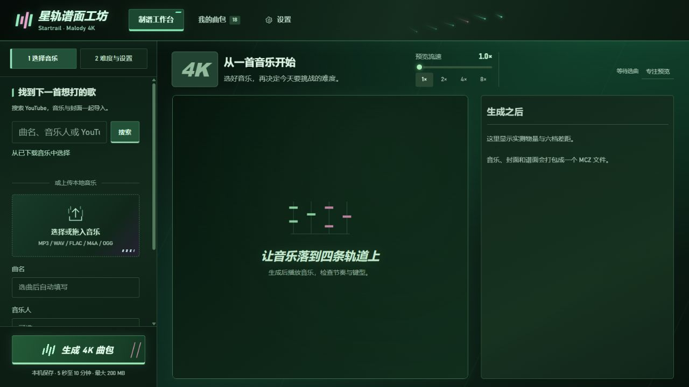
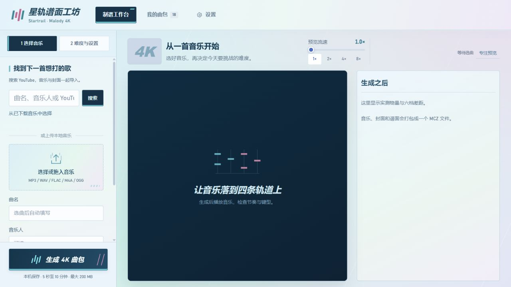

# 星轨谱面工坊 · Startrail

<div align="center">
  
  <h1>星轨谱面工坊<br><sub>STARTRAIL · MALODY CHART FORGE</sub></h1>
  <p><strong>把一首歌，变成四条轨道上的节奏。</strong><br>本地生成 · 六档难度 · 即时预览 · 一键导出 <code>.mcz</code></p>
  <p><strong>A song in. A four-lane chart out.</strong><br>Local generation · Six difficulty tiers · Live preview · One-click <code>.mcz</code> export</p>
  <p>
    
    
    
    <a href="https://github.com/DokiDokiYuyuko/Malody-Chart-Forge/stargazers"></a>
  </p>
  <p><a href="#简体中文">简体中文</a>　·　<a href="#english">English</a>　·　<a href="#一键配置推荐">快速开始</a></p>
</div>

<p align="center"></p>

<table>
  <tr>
    <td width="50%"></td>
    <td width="50%"><strong>两种节奏，一套工坊。</strong><br><br>「晴空轨道」以冰蓝、薄荷和淡粉铺开界面；「薄荷夜航」使用亮黑与荧光绿。鼠标移动时，短暂的流星沿轨迹划过。主题和效果都能在页面右上方的「设置」中调整。<br><br><a href="https://github.com/DokiDokiYuyuko/Malody-Chart-Forge">在 GitHub 查看项目 →</a></td>
  </tr>
</table>

<a id="简体中文"></a>

## 简体中文

Startrail 是为旧版 Malody 4K 与手机四指游玩设计的本地制谱工具。选择音乐与难度，检查谱面节奏和密度，再将结果打包成可导入的 `.mcz`。

> AI 生成的谱面会在曲包与报告中标明来源。难度数字用于调节生成目标，不是 Malody 官方定级。

## 功能

- 本地运行 MuG Diffusion 或 Mapperatorinator V32，为音乐生成 4K 谱面。
- Easy、Medium、Hard、Expert、Master、Lunatic 六档；逐档调整目标平均 NPS、滚动一秒峰值、同刻按键数、同轨间隔和长条上限。
- 手机四指规则检查、音符预览、音乐播放、统计报告，以及包含音轨和背景图的 `.mcz` 打包。
- 可上传本地音乐；也可搜索 YouTube 公开音源并下载到本机后制谱。在线搜索需要网络；本地推理不上传音频。
- 晴空与薄荷夜航两套主题、可关闭的鼠标流星，以及适配不同屏幕的工作台和曲包页面。
- 模型权重、音频、缓存、报告和曲包保存在项目目录。模型权重需单独下载，本仓库不分发权重或用户音乐。

## 系统要求

- Windows 10/11 x64；启动脚本为 PowerShell 和 `.bat`。
- Python 3.12 x64、Git，以及可用的 NVIDIA GPU/驱动。V32 使用 CUDA；MuG 有 CPU 回退，但速度未经验证。
- 本项目在 NVIDIA RTX 4080 SUPER 16 GB 上完成过生成测试。其他显卡和显存配置未经完整验证；首次安装需要数 GB 磁盘空间和稳定网络。
- 安装 PyTorch wheel 时无需单独安装完整 CUDA Toolkit；需要与 wheel 兼容的 NVIDIA 驱动。PyTorch 官方索引地址在锁文件中指定。

## 安装

以下命令在 PowerShell 中运行，仓库地址已填好。

### 1. 获取代码和上游源码

```powershell
git clone --recurse-submodules https://github.com/DokiDokiYuyuko/Malody-Chart-Forge.git
cd Malody-Chart-Forge
```

### 一键配置（推荐）

先安装 Python 3.12 x64 和 Git，再双击项目根目录的 `一键配置环境.bat`。脚本会让你选择 MuG、V32 或两者，创建项目内环境，按锁文件安装依赖并下载、校验所选权重；MuG 会实际加载权重检查模型结构，V32 会用自动生成的合成节奏音频执行本地冒烟推理。安装结束后可双击 `启动制谱台.bat`。

脚本会提示配置 pip 镜像、Hugging Face 兼容端点和 HTTP/HTTPS 代理；大陆网络可按自己的网络环境填写，留空则使用官方地址或已有环境变量。PyTorch CUDA wheel 地址仍由锁文件固定。MuG 权重下载前会要求确认上游非商业条款。安装日志保存在 `logs/setup.log`，V32 冒烟日志保存在 `logs/v32-setup-smoke.log`。

也可以从 PowerShell 显式传入配置，例如：

```powershell
.\setup.ps1 -Engine v32 -PipIndexUrl "https://你的可信镜像/simple" -HFEndpoint "https://你的 Hugging Face 兼容端点"
```

以上是快速入口；下面的命令适合希望逐步控制每个安装环节的用户。

如果之前没有初始化子模块：

```powershell
git submodule update --init --recursive
```

### 2. 安装主环境

项目使用独立 Python 环境运行网页、音频分析和 MuG。锁文件固定已验证的依赖与 PyTorch 2.5.1 + CUDA 12.4：

```powershell
py -3.12 -m venv .venv
.\.venv\Scripts\python.exe -m pip install --upgrade pip
.\.venv\Scripts\python.exe -m pip install -r requirements-lock.txt
```

验证显卡是否可用：

```powershell
.\.venv\Scripts\python.exe -c "import torch; print(torch.__version__); print(torch.cuda.is_available()); print(torch.cuda.get_device_name(0) if torch.cuda.is_available() else 'CPU mode')"
```

### 3. 下载 MuG 模型

MuG 是可选生成引擎之一；安装至少一个引擎即可使用制谱台。MuG 权重约 1.84 GB。请先阅读模型来源页面的使用条款；该权重及生成谱面有非商业使用限制。

```powershell
.\.venv\Scripts\python.exe tools\download_file.py `
  https://huggingface.co/ayousanz/Mug-Diffusion-model/resolve/main/model.ckpt `
  models\mug-diffusion\v1.0.0\model.ckpt `
  --workers 4 `
  --sha256 af6ab91337d0ef6b518367082ac3f849448c6daaa01fd987678fb25ea44ca184
```

验证权重哈希并实际加载模型结构：

```powershell
.\.venv\Scripts\python.exe tools\validate_mug_install.py
```

下载器支持分段续传，并在完成时校验 SHA-256。`models/mug-diffusion/v1.0.0/model.yaml` 已包含在代码仓库中；它的校验值登记在 [`models/README.md`](models/README.md)。权重来自 [MuG Diffusion 模型镜像](https://huggingface.co/ayousanz/Mug-Diffusion-model)，上游实现和条款见 [Keytoyze/Mug-Diffusion](https://github.com/Keytoyze/Mug-Diffusion)。

### 4. 可选：安装 Mapperatorinator V32

V32 使用单独的 Python 环境，不与 MuG 混装。模型约 1.73 GB；下载脚本默认锁定已验证的 Hugging Face revision，并校验文件哈希。

```powershell
py -3.12 -m venv runtime\mapperatorinator-venv
.\runtime\mapperatorinator-venv\Scripts\python.exe -m pip install --upgrade pip
.\runtime\mapperatorinator-venv\Scripts\python.exe -m pip install -r runtime\mapperatorinator-requirements-lock.txt
```

分别下载 4K mania 权重和分段节拍权重：

```powershell
.\.venv\Scripts\python.exe tools\download_mapperatorinator.py
.\.venv\Scripts\python.exe tools\download_mapperatorinator.py --base
.\runtime\mapperatorinator-venv\Scripts\python.exe tools\validate_v32_install.py
```

如需使用新的上游版本，应先确认模型结构与文件哈希，再显式传入 revision：

```powershell
.\.venv\Scripts\python.exe tools\download_mapperatorinator.py --revision <HUGGING_FACE_COMMIT>
```

V32 原始权重和版本清单见 [`models/README.md`](models/README.md)；项目使用的上游源码版本及推理限制见 [`docs/v32-deployment.md`](docs/v32-deployment.md)。V32 使用 CUDA，未安装其独立环境或权重时，网页会禁用该引擎。

### 5. 可选：启用 YouTube 搜索下载

本地上传和制谱不依赖 YouTube。若需要在线搜索，在仓库内下载官方 yt-dlp Windows 程序：

```powershell
New-Item -ItemType Directory -Force runtime\bin | Out-Null
Invoke-WebRequest `
  https://github.com/yt-dlp/yt-dlp/releases/latest/download/yt-dlp.exe `
  -OutFile runtime\bin\yt-dlp.exe
```

只支持无需登录、公开可访问的单曲音源；不会读取浏览器 Cookie、绕过登录、付费或 DRM 限制。请确保你有权下载和使用相应音频。

## 启动

安装至少一个模型后，双击 `启动制谱台.bat`，或在 PowerShell 运行：

```powershell
.\start.ps1
```

启动器通常使用 `http://127.0.0.1:8765`。若旧版服务仍占用该端口，启动器会检测版本并在 `8766` 启动更新后的应用。服务只绑定本机地址，不要将端口转发到公网；健康状态接口与网页使用相同端口。

选择本地音乐或公开在线音源，填写/确认曲名和音乐人，勾选要生成的难度，点击生成。完成后下载 `.mcz`；曲包默认位于 `outputs/<任务编号>/malody-4k.mcz`，同目录的 `report.json` 保存参数、统计和检查结果。

网页使用「**星轨谱面工坊 · Startrail**」作为界面名称。点击顶部「我的曲包」右侧的「设置」，可切换「晴空轨道」亮色主题和「薄荷夜航」暗色主题，并开启或关闭鼠标流星拖尾。选择会保存在当前浏览器，刷新后仍生效；「恢复外观默认」只调整外观，不改变谱面生成参数。系统启用减少动态效果时，拖尾自动停用。

## 难度和模型设置

顶部六档是**最终谱面**的目标。卡片数字是目标平均 NPS；“按难度细调谱面规则”还能修改每档滚动一秒峰值、同刻上限、同轨间隔和长条上限。起音不足时会降低实测密度并提示，不会只为凑目标在音乐空白处加音符。

“模型与更多设置”里的模型参考难度控制模型生成共享母谱时的输入条件，不等同于 Malody 等级，也不需要与六个档位逐一对应。MuG 的参考值是 osu! SR 条件；V32 使用其自身 1–10 难度条件。建议先用默认值，再根据预览和实测结果调整。

NPS 和档位名称都不是 Malody 官方定级。`.mcz` 会通过 ZIP、MC JSON、轨道、时间轴和音频引用检查，但格式检查不能代替手机实机导入与手感测试。

## 命令行生成

先按上方步骤启动本地服务，再使用主环境执行。例如生成 Easy、Hard 和 Lunatic：

```powershell
.\.venv\Scripts\python.exe tools\generate.py `
  --audio "D:\Music\song.flac" `
  --title "曲名" `
  --artist "音乐人" `
  --difficulties easy hard lunatic `
  --engine v32
```

不写 `--engine` 时使用 MuG。命令行常用选项见：

```powershell
.\.venv\Scripts\python.exe tools\generate.py --help
```

## 数据和目录

```text
models/      模型配置、清单和本地权重（权重不提交）
runtime/     V32 独立环境；yt-dlp 本地程序
vendor/      固定版本的 MuG 与 Mapperatorinator Git 子模块
uploads/     用户上传音频和已下载音乐
outputs/     生成的 MCZ、报告和任务状态
cache/       模型与音频临时缓存
logs/        服务与生成日志
docs/        模型选择、部署和验证记录
tests/       自动化测试
```

用户数据目录、环境、缓存、日志和大型 checkpoint 已列入 `.gitignore`。不要把音频、曲包、`model.ckpt`、`model.safetensors` 或虚拟环境提交到 GitHub。权重文件大小、来源与 SHA-256 见 [`models/README.md`](models/README.md)。

## 开发与测试

```powershell
.\.venv\Scripts\python.exe -m pytest -q
.\.venv\Scripts\python.exe -m compileall -q malody_studio tools
node --check web\app.js
```

当前测试覆盖参数校验、六档校准、音频处理、Mapperatorinator 转换、曲包结构和本地音乐库。手机端真实导入与手感不属于自动化测试范围。

## 模型、代码和音乐的使用条款

- **MuG 权重与其生成谱面：** 上游说明为非商业使用。项目不打包或托管该 checkpoint；下载者需自行阅读并遵守模型来源页及上游仓库的条款。
- **Mapperatorinator：** 上游代码与模型卡标注 MIT；仍请查看对应固定版本中的许可证和模型卡。
- **用户音乐与封面：** 用户需自行确认拥有下载、处理和使用权。生成谱面不会改变原音乐的权利归属。
- **AI 标注：** 输出 MC、曲包说明和报告标记生成引擎及 AI 来源；分享时请保留相关信息。
- Malody、osu!、MuG Diffusion、Mapperatorinator 和 yt-dlp 名称/商标归各自权利人。本项目不代表或获得其官方背书。

## 进一步阅读

- [模型选择与格式依据](docs/model-selection.md)
- [其他模型调研](docs/alternative-models-2026-10-02.md)
- [V32 部署和限制](docs/v32-deployment.md)
- [六档参数和验证记录](docs/studio-v2.md)
- [模型权重版本和校验值](models/README.md)
- [用户体验优化需求与实施方案](docs/requirements-and-implementation-plan.md)

---

<a id="english"></a>

## English

**Startrail · Malody Chart Forge** turns a song into a four-lane rhythm chart for classic Malody 4K. Generate locally, shape six difficulty tiers, review the timing in the browser, and export an `.mcz` package.

> This is an independent community project and is not affiliated with Malody. Generated charts should retain their AI disclosure. Their displayed difficulty is an estimate, not an official rating or a guarantee of playability.

### Features

- Generate 4K charts with local MuG Diffusion or Mapperatorinator V32 models.
- Create Easy, Medium, Hard, Expert, Master, and Lunatic charts with configurable density and playability limits.
- Preview four lanes, listen to the music, inspect chart statistics, and export an `.mcz` package with its audio and background image.
- Upload local music. Optional YouTube search and download is available for publicly accessible tracks.
- Switch between a sky-toned light theme and a glossy mint-night theme, with optional mouse meteor trails.
- Inference runs locally. Model weights, music, generated packages, and caches stay in the project folders; model weights are downloaded separately.

### Requirements

- Windows 10/11 x64, Python 3.12 x64, Git, and a compatible NVIDIA GPU/driver for V32.
- PyTorch 2.5.1 with CUDA 12.4 is pinned in the main lock file. A separate environment is used for V32. A full CUDA Toolkit installation is not required for the pinned PyTorch wheel.
- The project has been tested on an NVIDIA RTX 4080 SUPER with 16 GB VRAM. Other hardware has not been fully validated. Allow several gigabytes of free disk space and a reliable connection for first-time setup.

### Install

Run these commands in PowerShell. They clone the source repositories used by the inference engines as Git submodules:

```powershell
git clone --recurse-submodules https://github.com/DokiDokiYuyuko/Malody-Chart-Forge.git
cd Malody-Chart-Forge
```

### One-click setup (recommended)

Install Python 3.12 x64 and Git, then double-click `一键配置环境.bat` in the project folder. Choose MuG, V32, or both. The script creates project-local environments, installs pinned dependencies, and downloads and verifies the selected model weights. It loads MuG to check the checkpoint and model structure, and runs V32 inference on a generated synthetic rhythm signal. Setup validation never uses your music. You can then launch the app with `启动制谱台.bat`.

The script asks for an optional pip mirror, Hugging Face-compatible endpoint, and HTTP/HTTPS proxy. Leave fields blank to use official endpoints or existing environment variables. The CUDA PyTorch wheel source stays pinned in the lock files. Before downloading MuG, the script asks you to confirm its upstream non-commercial terms. Logs are saved under `logs/`.

For example, configure a V32 install from PowerShell with:

```powershell
.\setup.ps1 -Engine v32 -PipIndexUrl "https://your-trusted-mirror/simple" -HFEndpoint "https://your-hugging-face-compatible-endpoint"
```

Manual steps follow for users who want to control each stage:

If you already cloned without submodules:

```powershell
git submodule update --init --recursive
```

Create the main environment and install the pinned dependencies:

```powershell
py -3.12 -m venv .venv
.\.venv\Scripts\python.exe -m pip install --upgrade pip
.\.venv\Scripts\python.exe -m pip install -r requirements-lock.txt
```

Check whether PyTorch can see your GPU:

```powershell
.\.venv\Scripts\python.exe -c "import torch; print(torch.__version__); print(torch.cuda.is_available()); print(torch.cuda.get_device_name(0) if torch.cuda.is_available() else 'CPU mode')"
```

### Install model weights

**MuG Diffusion** is one of the available engines; installing at least one engine enables chart generation. Its checkpoint is about 1.84 GB. Review the upstream terms before downloading: the weights and charts generated with them are restricted to non-commercial use. Download into the project’s `models/` directory and verify the SHA-256 hash:

```powershell
.\.venv\Scripts\python.exe tools\download_file.py `
  https://huggingface.co/ayousanz/Mug-Diffusion-model/resolve/main/model.ckpt `
  models\mug-diffusion\v1.0.0\model.ckpt `
  --workers 4 `
  --sha256 af6ab91337d0ef6b518367082ac3f849448c6daaa01fd987678fb25ea44ca184
```

Verify the checkpoint hash and load the model structure:

```powershell
.\.venv\Scripts\python.exe tools\validate_mug_install.py
```

The model configuration is included in the repository. The checkpoint is not. See [MuG Diffusion on Hugging Face](https://huggingface.co/ayousanz/Mug-Diffusion-model) and the [upstream implementation and terms](https://github.com/Keytoyze/Mug-Diffusion).

**Mapperatorinator V32** is optional and uses a separate Python environment. Its model files total about 1.73 GB:

```powershell
py -3.12 -m venv runtime\mapperatorinator-venv
.\runtime\mapperatorinator-venv\Scripts\python.exe -m pip install --upgrade pip
.\runtime\mapperatorinator-venv\Scripts\python.exe -m pip install -r runtime\mapperatorinator-requirements-lock.txt
.\.venv\Scripts\python.exe tools\download_mapperatorinator.py
.\.venv\Scripts\python.exe tools\download_mapperatorinator.py --base
.\runtime\mapperatorinator-venv\Scripts\python.exe tools\validate_v32_install.py
```

The downloader pins a verified Hugging Face revision and checks file hashes. For model versions, hashes, and deployment limits, see [`models/README.md`](models/README.md) and [`docs/v32-deployment.md`](docs/v32-deployment.md). V32 requires its own environment and CUDA; the web app disables it when either the environment or weights are missing.

### Optional YouTube search

Local uploads work without YouTube. To enable search for publicly accessible single tracks, download the official yt-dlp Windows executable:

```powershell
New-Item -ItemType Directory -Force runtime\bin | Out-Null
Invoke-WebRequest `
  https://github.com/yt-dlp/yt-dlp/releases/latest/download/yt-dlp.exe `
  -OutFile runtime\bin\yt-dlp.exe
```

The app does not read browser cookies or bypass sign-in, paid access, or DRM. Only download music you are authorized to use.

### Start and generate a chart

After installing at least one engine, double-click `启动制谱台.bat` or run:

```powershell
.\start.ps1
```

The launcher normally uses `http://127.0.0.1:8765`. If an older service still occupies that port, it checks the version and starts the updated app on `8766`. The service binds to localhost; do not expose it to the public internet.

Upload an audio file or select an available public track, confirm its title and artist, choose one or more difficulties, and click **Generate 4K charts**. Download the resulting `.mcz` from the page. Output packages and a `report.json` are saved under `outputs/<job-id>/`.

The web interface is named **Startrail (星轨谱面工坊)**. Open **Settings (设置)** beside the library tab to choose the light sky theme or the dark mint theme, and toggle mouse meteor trails. Preferences are saved in your current browser across reloads. Restoring appearance defaults does not change chart generation settings. Trails are disabled when your system requests reduced motion.

You can also generate charts from PowerShell. For example, to create Easy, Hard, and Lunatic charts with V32:

```powershell
.\.venv\Scripts\python.exe tools\generate.py `
  --audio "D:\Music\song.flac" `
  --title "Song title" `
  --artist "Artist" `
  --difficulties easy hard lunatic `
  --engine v32
```

MuG is used when `--engine` is omitted. List all command-line options with:

```powershell
.\.venv\Scripts\python.exe tools\generate.py --help
```

### Difficulty and model settings

The six difficulty presets control the **output charts**: their target average NPS, rolling one-second peak, maximum simultaneous notes, same-lane spacing, and long-note limits. When the music does not contain enough clear attacks, the generator lowers the measured density and reports it instead of filling silent sections just to hit a target.

The model reference difficulty under **Model and advanced settings** is only an input condition for the shared source chart. It is not a Malody level and does not need to match any of the six output presets. MuG uses an osu! star-rating condition; V32 uses its own 1–10 condition. Start with the defaults and adjust after reviewing the preview and measured statistics.

NPS and the preset labels are not official Malody ratings. Package validation checks the ZIP, MC JSON, tracks, timing, and audio references, but it cannot replace importing and play-testing the chart on a device.

### Project data and licensing

Model configurations and separately downloaded weights are stored in `models/`; audio, packages, logs, environments, and caches are stored under the project directory. These local files are excluded from Git by `.gitignore`. Do not commit music, `.mcz` files, model checkpoints, or virtual environments.

- MuG weights and charts generated with them are subject to the upstream non-commercial restriction. This repository does not distribute or host the checkpoint.
- Mapperatorinator’s upstream code and model card identify an MIT license; review the license and model card for the pinned revision.
- You are responsible for having the rights to download and process music and artwork. Generated charts do not change the rights to source music.
- Keep AI disclosure metadata when sharing generated charts. Third-party names and marks belong to their respective owners; this project is not officially endorsed by them.

For development checks, run `python -m pytest -q`, `python -m compileall -q malody_studio tools`, and `node --check web\app.js` from the project root using the project’s Python environment. Automated checks do not cover actual import or playability on a phone.

See also: [model selection](docs/model-selection.md), [other model research](docs/alternative-models-2026-10-02.md), [V32 deployment](docs/v32-deployment.md), [difficulty tuning and validation](docs/studio-v2.md), and [model versions and hashes](models/README.md), plus the [UX requirements and implementation plan](docs/requirements-and-implementation-plan.md).
