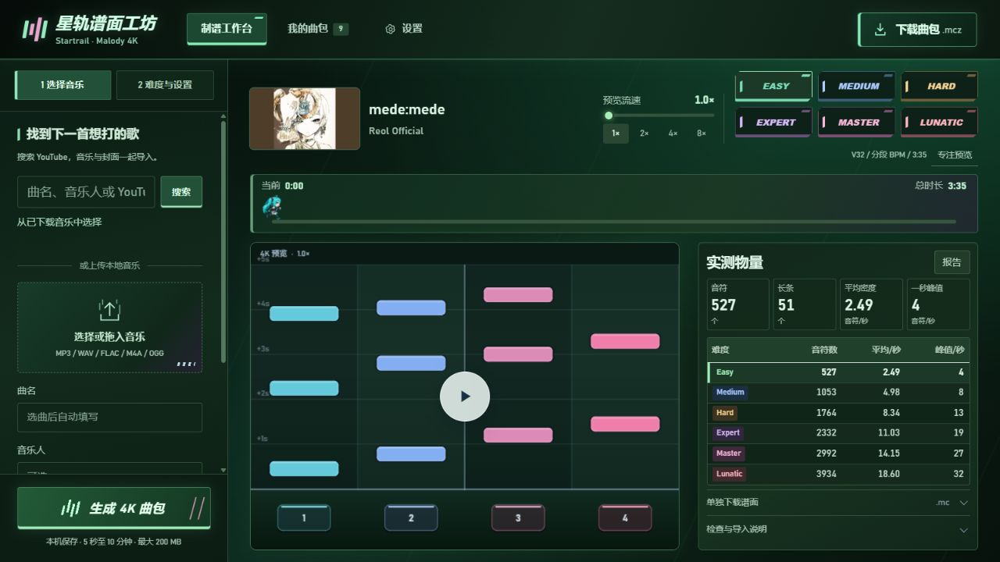
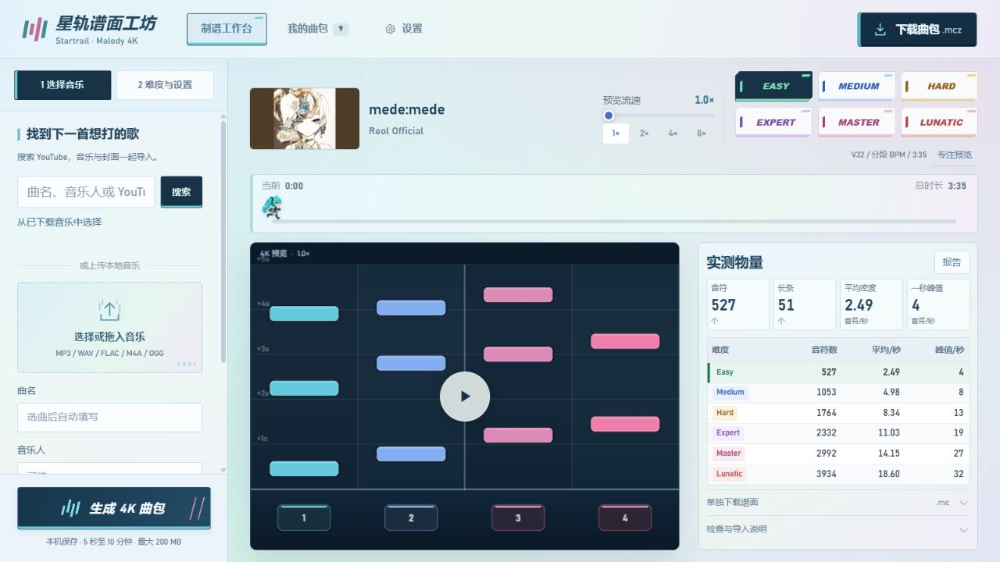
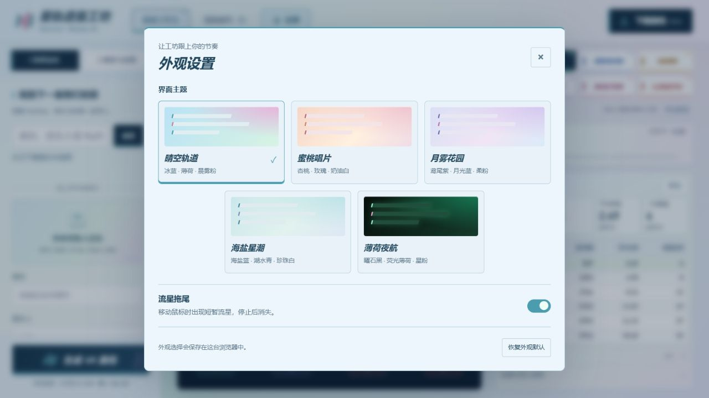
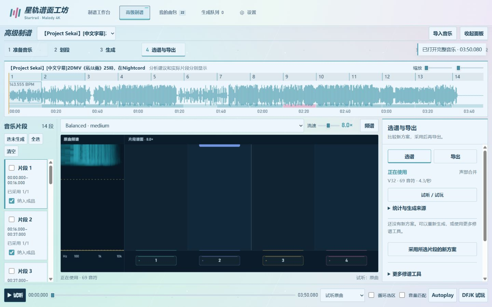
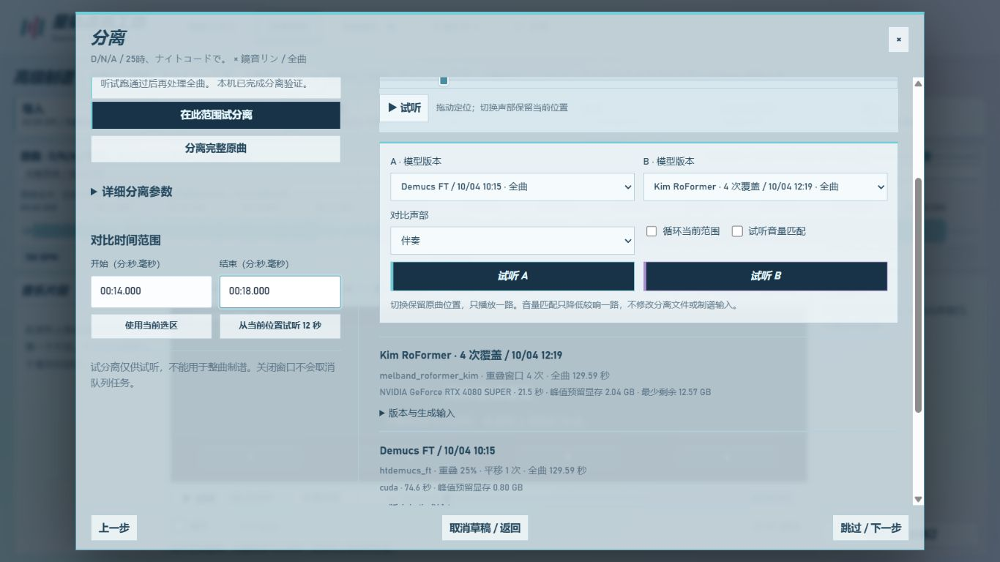
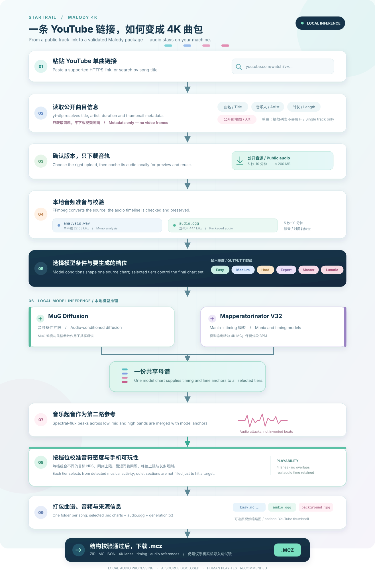

# 星轨谱面工坊 · Startrail

<div align="center">
  
  <h1>星轨谱面工坊<br><sub>STARTRAIL · MALODY CHART FORGE</sub></h1>
  <p><strong>把一首歌，变成四条轨道上的节奏。</strong><br>本地生成 · 六档难度 · 即时预览 · 一键导出 <code>.mcz</code></p>
  <p><strong>A song in. A four-lane chart out.</strong><br>Local generation · Six difficulty tiers · Live preview · One-click <code>.mcz</code> export</p>
  <p>
    
    
    
    <a href="https://github.com/DokiDokiYuyuko/Malody-Chart-Forge/stargazers"></a>
  </p>
  <p><a href="#简体中文">简体中文</a>　·　<a href="#english">English</a>　·　<a href="#一键配置推荐">快速开始</a>　·　<a href="CHANGELOG.md">开发者日志 / Changelog</a></p>
</div>

<p align="center"></p>
<p align="center"><sub>薄荷夜航 · Mint night — four-lane preview and compact playback controls</sub></p>

<table>
  <tr>
    <td width="50%" valign="top"><br><sub><strong>制谱工作台 / Chart workbench</strong> — 六档难度、谱面预览与统计。Six difficulty tiers, chart preview, and measured statistics.</sub></td>
    <td width="50%" valign="top"><br><sub><strong>我的曲包 / My charts</strong> — 桌面端 4×2 曲包卡片与分页。A 4×2 desktop grid with pagination.</sub></td>
  </tr>
</table>

<p align="center"></p>
<p align="center"><sub>五款配色：晴空、蜜桃、月雾、海盐与薄荷夜航 · Five palettes: Sky, Peach, Moon Mist, Sea Salt, and Mint Night</sub></p>

<a id="简体中文"></a>

## 简体中文

Startrail 是为旧版 Malody 4K 与手机四指游玩设计的本地制谱工具。选择音乐与难度，检查谱面节奏和密度，再将结果打包成可导入的 `.mcz`。

> AI 生成的谱面会在曲包与报告中标明来源。难度数字用于调节生成目标，不是 Malody 官方定级。

## 功能

- 本地运行 MuG Diffusion 或 Mapperatorinator V32，为音乐生成 4K 谱面。
- **高级制谱：** 波形划段、逐档独立生成、片段候选版本、同步 A/B、拼接预览与 MCZ 导出；[使用指南（中英文）](docs/advanced-authoring-guide.md)。
- **同步听音：** 滚动频谱与四轨共用播放时钟；试听与试玩互斥，Esc 暂停 / 继续，内嵌结算与重试。
- **声部与段落：** Demucs 快速分离与 Kim Mel-Band RoFormer 高质量档；先局部试分离，同位置 A/B 循环比较，再选择完整人声 / 伴奏制谱并联合排键。按节奏活动与可信 BPM 调整段落条件，保留原谱与候选版本。[分离使用与安装](docs/separation-upgrade-guide.md) · [本机音频与 GPU 对照](docs/separation-upgrade-validation.md) · [动态难度](docs/adaptive-sections.md)。
- **Agent 修谱：** 用户配置修谱 / 听音 API，通过本地音频与时序工具提出可验证修改，比较后手动应用；[需求与实现约定](docs/advanced-authoring-and-agent-requirements.md)。
- Easy、Medium、Hard、Expert、Master、Lunatic 六档；逐档调整目标平均 NPS、滚动一秒峰值、同刻按键数、同轨间隔和长条上限。
- 手机四指规则检查、音符预览、音乐播放、统计报告，以及包含音轨和背景图的 `.mcz` 打包。
- 可上传本地音乐；也可搜索 YouTube 公开音源并下载到本机后制谱。在线搜索需要网络；本地推理不上传音频。
- 高级台的云端 Agent 独立于本地推理；仅在用户开启评审时向配置的服务发送当前窗口证据，听音片段可单独开关。API 密钥可用 Windows 用户加密保存。
- 晴空、蜜桃、月雾、海盐、薄荷夜航五套主题；可关闭的鼠标流星；适配不同屏幕的工作台和曲包页面。
- 模型权重、音频、缓存、报告和曲包保存在项目目录。模型权重需单独下载，本仓库不分发权重或用户音乐。
- 从 YouTube 链接导入到 `.mcz` 输出的完整流程见下方[双语流程图](#workflow)。

### 高级制谱 / Advanced authoring

<p align="center"></p>

完整音乐导入即可开始，四个模式围绕常驻时间轴工作：准备音乐 → 划段 → 生成 → 选谱与导出。节奏建议先预览，再一次应用为真实片段；多选片段批量生成，两路输入默认产出合并候选。试听音轨与模型输入分别选择，A/B 保持音乐位置。手动采用后预览成品并导出；规则与 Agent 保留旧版，云端评审使用自己的 API。

Start from complete audio and an empty chart. Prepare, segment, generate and select/export share a persistent music timeline. Preview analysis suggestions before atomically creating real segments, then batch-generate selected combinations. Dual-stem generation produces a merged candidate. Audition and model inputs remain separate; A/B keeps one clock. Adopt explicitly, preview the edit and export. Rules and Agent revisions preserve older versions; cloud review uses your own API.

[中英文操作指南 / User guide](docs/advanced-authoring-guide.md) · [时间、版本与 Agent 约定 / Specification](docs/advanced-authoring-and-agent-requirements.md) · [审谱 Skill / Review skill](skills/malody-chart-review/SKILL.md)

[频谱、分轨、动态段落与实际验收 / Spectrum, stems, adaptive sections and validation](docs/workflow-enhancement-validation.md)

### 人声与伴奏分离 / Vocal separation

<p align="center"></p>

先试一段、听清差别，再处理整曲。Kim 质量档在本机 4080 SUPER 上完成两首全曲的 2 / 4 次覆盖测试，4 次覆盖端到端约 29 / 44 秒；进程峰值预留显存约 2.04 GiB。分离结果同帧数、同采样时钟，局部预览不冒充整曲输入。六个重点窗口的声音对照与十组同种子制谱记录均保留；听感与采音分别比较后手动采用。

Try a range before separating the whole song. Kim's high-quality preset completed two full-song, 2× / 4× coverage comparisons on the local RTX 4080 SUPER; 4× coverage took about 29 / 44 seconds end to end with 2.04 GiB peak reserved process memory. Aligned A/B uses one player and optional attenuation-only volume matching. Existing audio and selected charts stay intact; local trial clips remain preview-only.

[操作与独立环境安装 / Usage and setup](docs/separation-upgrade-guide.md) · [六个窗口、实际采音与硬件记录 / Measured validation](docs/separation-upgrade-validation.md)

## 配置要求与实测表现

下面把本机实测、实用建议和安装占用分开列出，避免把推荐配置误当成硬性最低配置。

**平台：** 启动脚本面向 Windows 10/11 x64。**实测主机：** Windows 11 x64、Intel Core i5-12600KF、32 GB RAM、NVIDIA GeForce RTX 4080 SUPER（16 GB VRAM）、NVIDIA 驱动 591.86、Python 3.12 x64。主环境为 PyTorch 2.5.1 + CUDA 12.4；V32 独立环境为 PyTorch 2.10.0 + CUDA 13.0。两个环境均实测 `torch.cuda.is_available() = True` 并成功生成。

| 引擎 | 本机完整曲目记录 | PyTorch 峰值显存 |
| --- | --- | --- |
| Mapperatorinator V32 | 7 次；曲长 3:23–7:27；端到端 73.5–195.4 秒，其中模型阶段 52.3–135.1 秒 | 1.22–1.60 GiB 已分配显存 |
| MuG Diffusion | 2 次；曲长 4:03、4:18；端到端 42.3、42.7 秒 | 当前报告未记录 |

V32 的显存数字来自 PyTorch allocator 统计，不等于整张显卡的总占用；速度会随歌曲、难度档数和后台负载变化。它们是本项目在上述主机上的完整曲生成记录，不是最低显存门槛或速度保证。

**实用建议：** V32 需要 NVIDIA CUDA GPU。日常使用建议 8 GB 显存、16 GB 系统内存；16 GB 显存是本项目已完整验证的配置。MuG 支持 CPU 回退，但本机没有验证 CPU 生成速度。MuG 上游报告过在 4 GB RTX 3050 Ti 上生成 3 分钟歌曲的结果，这只能作为 MuG 上游参考，不代表本项目在该显卡上完成过验证。

V32 锁定 CUDA 13.0 wheel，Windows 建议安装 NVIDIA R580 系列或更新驱动；本机实测驱动为 591.86。主环境还包含 CUDA 12.4 wheel。锁定的 PyTorch wheel 已包含运行时，正常使用不需要另装完整 CUDA Toolkit；只有自行编译 CUDA 扩展或从源码构建时才需要开发工具链。参考 [NVIDIA CUDA 兼容性说明](https://docs.nvidia.com/deploy/cuda-compatibility/minor-version-compatibility.html) 和 [PyTorch 安装指南](https://pytorch.org/get-started/locally/)。

**磁盘空间按当前安装目录实测（GiB）：**

| 目录 | 占用 |
| --- | ---: |
| 主环境 `.venv` | 4.98 |
| 上游源码 `vendor/` | 1.73 |
| MuG 权重 | 1.71 |
| V32 独立环境 | 3.38 |
| V32 权重 | 1.62 |
| 两个引擎全部安装合计 | 13.42 |

仅装 MuG 时，上述目录合计约 8.42 GiB；仅装 V32 约 11.71 GiB。若安装两个引擎，建议项目所在磁盘至少预留 20 GiB，以覆盖下载临时文件和安装缓存；表中没有计算用户音乐、输出曲包和后续缓存。首次配置还需要稳定网络下载依赖、源码和所选权重。

<a id="workflow"></a>
## 工作流程图

<p align="center"></p>

## 安装

以下命令在 PowerShell 中运行，仓库地址已填好。

### 1. 获取代码和上游源码

```powershell
git clone --recurse-submodules https://github.com/DokiDokiYuyuko/Malody-Chart-Forge.git
cd Malody-Chart-Forge
```

### 一键配置（推荐）

先安装 Python 3.12 x64 和 Git，再双击项目根目录的 `一键配置环境.bat`。脚本会让你选择 MuG、V32 或两者，创建项目内环境，按锁文件安装依赖并下载、校验所选权重；MuG 会实际加载权重检查模型结构，V32 会用自动生成的合成节奏音频执行本地冒烟推理。安装结束后可双击 `启动制谱台.bat`。

脚本会提示配置 pip 镜像、Hugging Face 兼容端点和 HTTP/HTTPS 代理；大陆网络可按自己的网络环境填写，留空则使用官方地址或已有环境变量。PyTorch CUDA wheel 地址仍由锁文件固定。MuG 权重下载前会要求确认上游非商业条款。安装日志保存在 `logs/setup.log`，V32 冒烟日志保存在 `logs/v32-setup-smoke.log`。

也可以从 PowerShell 显式传入配置，例如：

```powershell
.\setup.ps1 -Engine v32 -PipIndexUrl "https://你的可信镜像/simple" -HFEndpoint "https://你的 Hugging Face 兼容端点"
```

以上是快速入口；下面的命令适合希望逐步控制每个安装环节的用户。

如果之前没有初始化子模块：

```powershell
git submodule update --init --recursive
```

### 2. 安装主环境

项目使用独立 Python 环境运行网页、音频分析和 MuG。锁文件固定已验证的依赖与 PyTorch 2.5.1 + CUDA 12.4：

```powershell
py -3.12 -m venv .venv
.\.venv\Scripts\python.exe -m pip install --upgrade pip
.\.venv\Scripts\python.exe -m pip install -r requirements-lock.txt
```

验证显卡是否可用：

```powershell
.\.venv\Scripts\python.exe -c "import torch; print(torch.__version__); print(torch.cuda.is_available()); print(torch.cuda.get_device_name(0) if torch.cuda.is_available() else 'CPU mode')"
```

### 3. 下载 MuG 模型

MuG 是可选生成引擎之一；安装至少一个引擎即可使用制谱台。MuG 权重约 1.84 GB。请先阅读模型来源页面的使用条款；该权重及生成谱面有非商业使用限制。

```powershell
.\.venv\Scripts\python.exe tools\download_file.py `
  https://huggingface.co/ayousanz/Mug-Diffusion-model/resolve/main/model.ckpt `
  models\mug-diffusion\v1.0.0\model.ckpt `
  --workers 4 `
  --sha256 af6ab91337d0ef6b518367082ac3f849448c6daaa01fd987678fb25ea44ca184
```

验证权重哈希并实际加载模型结构：

```powershell
.\.venv\Scripts\python.exe tools\validate_mug_install.py
```

下载器支持分段续传，并在完成时校验 SHA-256。`models/mug-diffusion/v1.0.0/model.yaml` 已包含在代码仓库中；它的校验值登记在 [`models/README.md`](models/README.md)。权重来自 [MuG Diffusion 模型镜像](https://huggingface.co/ayousanz/Mug-Diffusion-model)，上游实现和条款见 [Keytoyze/Mug-Diffusion](https://github.com/Keytoyze/Mug-Diffusion)。

### 4. 可选：安装 Mapperatorinator V32

V32 使用单独的 Python 环境，不与 MuG 混装。模型约 1.73 GB；下载脚本默认锁定已验证的 Hugging Face revision，并校验文件哈希。

```powershell
py -3.12 -m venv runtime\mapperatorinator-venv
.\runtime\mapperatorinator-venv\Scripts\python.exe -m pip install --upgrade pip
.\runtime\mapperatorinator-venv\Scripts\python.exe -m pip install -r runtime\mapperatorinator-requirements-lock.txt
```

分别下载 4K mania 权重和分段节拍权重：

```powershell
.\.venv\Scripts\python.exe tools\download_mapperatorinator.py
.\.venv\Scripts\python.exe tools\download_mapperatorinator.py --base
.\runtime\mapperatorinator-venv\Scripts\python.exe tools\validate_v32_install.py
```

如需使用新的上游版本，应先确认模型结构与文件哈希，再显式传入 revision：

```powershell
.\.venv\Scripts\python.exe tools\download_mapperatorinator.py --revision <HUGGING_FACE_COMMIT>
```

V32 原始权重和版本清单见 [`models/README.md`](models/README.md)；项目使用的上游源码版本及推理限制见 [`docs/v32-deployment.md`](docs/v32-deployment.md)。V32 使用 CUDA，未安装其独立环境或权重时，网页会禁用该引擎。

### 5. 可选：启用 YouTube 搜索下载

本地上传和制谱不依赖 YouTube。若需要在线搜索，在仓库内下载官方 yt-dlp Windows 程序：

```powershell
New-Item -ItemType Directory -Force runtime\bin | Out-Null
Invoke-WebRequest `
  https://github.com/yt-dlp/yt-dlp/releases/latest/download/yt-dlp.exe `
  -OutFile runtime\bin\yt-dlp.exe
```

只支持无需登录、公开可访问的单曲音源；不会读取浏览器 Cookie、绕过登录、付费或 DRM 限制。请确保你有权下载和使用相应音频。

## 启动

安装至少一个模型后，双击 `启动制谱台.bat`，或在 PowerShell 运行：

```powershell
.\start.ps1
```

启动器通常使用 `http://127.0.0.1:8765`。若旧版服务仍占用该端口，启动器会检测版本并在 `8766` 启动更新后的应用。服务只绑定本机地址，不要将端口转发到公网；健康状态接口与网页使用相同端口。

选择本地音乐或公开在线音源，填写/确认曲名和音乐人，勾选要生成的难度，点击生成。完成后下载 `.mcz`；曲包默认位于 `outputs/<任务编号>/malody-4k.mcz`，同目录的 `report.json` 保存参数、统计和检查结果。

网页使用「**星轨谱面工坊 · Startrail**」作为界面名称。点击顶部「我的曲包」右侧的「设置」，可切换晴空、蜜桃、月雾、海盐与薄荷夜航五款主题，并开启或关闭鼠标流星拖尾。曲包与歌曲封面按 16:9 显示，完整保留原图。设置会保存在当前浏览器；系统启用减少动态效果时，拖尾自动停用。

### 搜索、多曲队列与谱面迭代

YouTube 搜索每页显示最多 20 条公开单曲结果，可按时长筛选并继续加载；结果会按视频 ID 去重，并显示频道、时长和来源链接。搜索结果支持多选，一批最多 20 首；提交时会把当前引擎、难度和参数作为同一份设置快照。队列按先进先出顺序运行，失败任务不会阻塞后续歌曲；可取消尚未开始的任务，手动重试会排到队尾。首版不强制中断正在运行的 GPU 推理。

在线导入会请求 yt-dlp 当前可用的最佳纯音频流，不再优先选可能较低码率的 M4A。YouTube 音频仍是平台提供的有损编码；曲包为旧版 Malody 兼容性会另转为 OGG Vorbis。项目不会自动对音乐降噪，因为通用降噪可能抹掉鼓点、齿音和轻音起音；要处理疑似底噪，应保留原曲音轨，并先对“仅供谱面分析”的降噪结果做试听和谱面 A/B 对比。

服务重启后，原等待任务会暂停，需在「生成队列」点「继续暂停的任务」；当时正在生成的任务标记为中断，可重新尝试。无法从旧记录恢复来源的任务会提示重新导入音乐。默认始终串行运行。只有本机完整通过 MuG 与 V32 的短、中、长音频生成、三种双任务组合、MCZ 检查及至少 2 GiB 空闲显存门槛后，设置页才允许选择最多 2 路并行；其他设备继续串行。

生成报告会标出局部密度偏高、疑似静音段出现音符和短于 1/24 拍的细分音符。点击告警可切换到对应难度并跳至相关时间。这些是供人工复核的启发式提示，不自动改谱，也不代表官方等级。轨道重叠等结构错误会阻止导出，并保留冲突轨道和时间供预览定位。

在生成结果中可以选择单个难度重新生成。工具复用本地任务目录中的共享候选音符、时间轴与设置记录，不重复运行整首歌的模型；每个版本的 `.mc`、统计和完整 `.mcz` 均会保留，可查看版本数据并恢复旧版。历史任务若没有生成缓存，需要先重新生成整曲才能启用单档迭代。

### 本机硬件基准与并行资格

基准脚本会为 MuG、V32 各执行短/中/长完整生成，再按需执行 MuG+MuG、MuG+V32 和 V32+V32 双任务压力测试。准备三段本地且有权使用的音频（短 5–60 秒、中 60–180 秒、长 180–600 秒），使用项目环境运行：

```powershell
.\.venv\Scripts\python.exe tools\hardware_benchmark.py `
  --short "D:\Music\short.wav" `
  --medium "D:\Music\medium.wav" `
  --long "D:\Music\long.wav"
```

测试会耗用显卡并为每种组合生成六档 MCZ；建议关闭其他 GPU 密集程序后运行。报告写入 `benchmarks/<时间戳>/benchmark.json`，最新资格摘要写入 `benchmarks/latest.json`。并行只在当前 GPU 与驱动匹配、全部单任务和双任务组合成功、曲包校验通过且压力测试期间至少保留 2 GiB 显存时解锁。只想先测单任务可加 `--skip-parallel`；这不会开放并行。该基准是设备本机实测，不用于推断其他显卡的最低配置。

## 难度和模型设置

顶部六档是**最终谱面**的目标。卡片数字是目标平均 NPS；“按难度细调谱面规则”还能修改每档滚动一秒峰值、同刻上限、同轨间隔和长条上限。起音不足时会降低实测密度并提示，不会只为凑目标在音乐空白处加音符。

“模型与更多设置”里的模型参考难度控制模型生成共享母谱时的输入条件，不等同于 Malody 等级，也不需要与六个档位逐一对应。MuG 的参考值是 osu! SR 条件；V32 使用其自身 1–10 难度条件。建议先用默认值，再根据预览和实测结果调整。

NPS 和档位名称都不是 Malody 官方定级。`.mcz` 会通过 ZIP、MC JSON、轨道、时间轴和音频引用检查，但格式检查不能代替手机实机导入与手感测试。

## 命令行生成

先按上方步骤启动本地服务，再使用主环境执行。例如生成 Easy、Hard 和 Lunatic：

```powershell
.\.venv\Scripts\python.exe tools\generate.py `
  --audio "D:\Music\song.flac" `
  --title "曲名" `
  --artist "音乐人" `
  --difficulties easy hard lunatic `
  --engine v32
```

不写 `--engine` 时使用 MuG。命令行常用选项见：

```powershell
.\.venv\Scripts\python.exe tools\generate.py --help
```

## 数据和目录

```text
models/      模型配置、清单和本地权重（权重不提交）
runtime/     V32 独立环境；yt-dlp 本地程序
vendor/      固定版本的 MuG 与 Mapperatorinator Git 子模块
uploads/     用户上传音频和已下载音乐
outputs/     生成的 MCZ、报告和任务状态
cache/       模型与音频临时缓存
logs/        服务与生成日志
docs/        模型选择、部署和验证记录
tests/       自动化测试
```

用户数据目录、环境、缓存、日志和大型 checkpoint 已列入 `.gitignore`。不要把音频、曲包、`model.ckpt`、`model.safetensors` 或虚拟环境提交到 GitHub。权重文件大小、来源与 SHA-256 见 [`models/README.md`](models/README.md)。

## 开发与测试

```powershell
.\.venv\Scripts\python.exe -m pytest -q
.\.venv\Scripts\python.exe -m compileall -q malody_studio tools
node --check web\app.js
```

当前测试覆盖参数校验、六档校准、音频处理、Mapperatorinator 转换、曲包结构和本地音乐库。手机端真实导入与手感不属于自动化测试范围。

## 参考、许可与免责声明

模型配置和单独下载的权重保存在 `models/`；音乐、曲包、日志、运行环境及缓存保存在项目目录，并由 `.gitignore` 排除。请勿将音乐、`.mcz`、模型权重或虚拟环境提交到 Git。

Startrail 是社区独立项目，与 Malody、模型作者、音乐发行方均无隶属或官方背书关系。项目面向个人、非商业的制谱练习与研究。当前仓库根目录没有统一的 `LICENSE`；Mapperatorinator 的 MIT 许可只适用于其上游对应部分，不自动覆盖整个 Startrail 仓库。各上游代码、模型权重和生成结果遵循各自条款；本说明不会额外授予音乐、插画或既有谱面的使用权。

- **MuG Diffusion：** [上游代码与使用说明](https://github.com/Keytoyze/Mug-Diffusion)；[模型权重页](https://huggingface.co/ayousanz/Mug-Diffusion-model)。上游明确声明模型权重及其生成谱面仅限非商业使用。分享 MuG 生成谱面时请保留 AI 标记。
- **Mapperatorinator V32：** [上游项目与许可证](https://github.com/OliBomby/Mapperatorinator/blob/main/LICENSE)；[本项目锁定的 V32 权重版本](https://huggingface.co/OliBomby/Mapperatorinator-v32/tree/74f22583400d259bf424819e11027c17933efe54)。上游代码和模型卡标注 MIT；这不覆盖输入音乐、封面图片或训练素材的权利。
- **Malody：** [官方 Malody 应用说明](https://apps.apple.com/us/app/malody/id989630809)（列出 MC 格式支持）与[官方导入指南](http://m.mugzone.net/wiki/175)；另见[项目采用的 MC/MCZ 格式实现依据](docs/model-selection.md)。导出的曲包通过本项目结构检查，不等于已在每种 Malody 版本或手机上实机验证。
- **音乐与封面：** 仅导入、下载和分享你有权使用的音频及图片；本地生成不会改变原作品的版权归属。在线搜索/下载不会绕过登录、付费限制或 DRM。
- **难度与 AI：** NPS 和档位名称是生成目标及实测统计，不是 Malody 官方定级，也不保证适合所有玩家。试玩后再分享，并保留生成引擎及 AI 来源信息。

本项目不对生成结果的准确性、可玩性或第三方平台兼容性作保证。发布、分享或商业使用前，请自行核对相关作品和组件的许可。

## 进一步阅读

- [模型选择与格式依据](docs/model-selection.md)
- [Malody 官方 MC 格式与导入指南](https://apps.apple.com/us/app/malody/id989630809)
- [其他模型调研](docs/alternative-models-2026-10-02.md)
- [V32 部署和限制](docs/v32-deployment.md)
- [六档参数和验证记录](docs/studio-v2.md)
- [模型权重版本和校验值](models/README.md)
- [用户体验优化需求与实施方案](docs/requirements-and-implementation-plan.md)

---

<a id="english"></a>

## English

**Startrail · Malody Chart Forge** turns a song into a four-lane rhythm chart for classic Malody 4K. Generate locally, shape six difficulty tiers, review the timing in the browser, and export an `.mcz` package.

The **Advanced authoring** desk adds sample-accurate segments, independent per-tier model generation, immutable candidates, synchronized A/B previews, and compact audio/chart assembly. The optional **Agent review** uses your own repair/listening API, local evidence tools, and explicit user-applied patches. See the [bilingual guide](docs/advanced-authoring-guide.md) and [requirements](docs/advanced-authoring-and-agent-requirements.md).

> This is an independent community project and is not affiliated with Malody. Generated charts should retain their AI disclosure. Their displayed difficulty is an estimate, not an official rating or a guarantee of playability.

### Features

- Generate 4K charts with local MuG Diffusion or Mapperatorinator V32 models.
- Create Easy, Medium, Hard, Expert, Master, and Lunatic charts with configurable density and playability limits.
- Preview four lanes, listen to the music, inspect chart statistics, and export an `.mcz` package with its audio and background image.
- Upload local music. Optional YouTube search and download is available for publicly accessible tracks.
- Choose among five palettes (Sky, Peach, Moon Mist, Sea Salt, and Mint Night), with optional mouse meteor trails and a responsive, paginated chart library.
- Inference runs locally. Model weights, music, generated packages, and caches stay in the project folders; model weights are downloaded separately.
- Follow the [bilingual workflow diagram](#workflow) from a public YouTube link to a validated `.mcz` package.

### Hardware and measured performance

The figures below distinguish a tested reference machine from practical recommendations. They are not claims about a minimum GPU.

**Platform:** the launch scripts target Windows 10/11 x64. **Tested reference:** Windows 11 x64, Intel Core i5-12600KF, 32 GB RAM, NVIDIA GeForce RTX 4080 SUPER (16 GB VRAM), NVIDIA driver 591.86, and Python 3.12 x64. The main environment uses PyTorch 2.5.1 + CUDA 12.4; V32 has a separate PyTorch 2.10.0 + CUDA 13.0 environment. CUDA was available in both environments and both engines completed generation.

| Engine | Full-song runs on this machine | PyTorch peak memory |
| --- | --- | --- |
| Mapperatorinator V32 | 7 runs; tracks 3:23–7:27; 73.5–195.4 seconds end to end, including 52.3–135.1 seconds in the model stage | 1.22–1.60 GiB allocated |
| MuG Diffusion | 2 runs; tracks 4:03 and 4:18; 42.3 and 42.7 seconds end to end | Not recorded in the reports |

V32 figures are PyTorch allocator measurements, not total GPU memory usage. Runtime varies with the song, selected tiers, and background load. These are completed runs on the listed machine, not a minimum VRAM threshold or a speed guarantee.

**Practical target:** V32 requires an NVIDIA CUDA GPU. For comfortable use, target 8 GB VRAM and 16 GB system RAM; 16 GB VRAM is the configuration this project has fully validated. MuG can fall back to CPU, but CPU generation speed has not been measured here. The MuG upstream reports generating four charts from a three-minute track on an RTX 3050 Ti with 4 GB VRAM; that is an upstream reference, not a Startrail test on that card.

The pinned V32 wheel uses CUDA 13.0. On Windows, use an NVIDIA R580-series or newer driver; this machine was tested on 591.86. The main environment also uses a CUDA 12.4 wheel. The pinned PyTorch wheels include their runtime, so a separate full CUDA Toolkit is unnecessary for normal use. A development toolkit is only needed when compiling CUDA extensions or building from source. See [NVIDIA’s CUDA compatibility guide](https://docs.nvidia.com/deploy/cuda-compatibility/minor-version-compatibility.html) and [PyTorch’s install selector](https://pytorch.org/get-started/locally/).

**Measured installed folders (GiB):**

| Folder | Size |
| --- | ---: |
| Main environment, `.venv` | 4.98 |
| Upstream source, `vendor/` | 1.73 |
| MuG weights | 1.71 |
| V32 environment | 3.38 |
| V32 weights | 1.62 |
| Both engines installed | 13.42 |

The measured folders total about 8.42 GiB for MuG alone or 11.71 GiB for V32 alone. For both engines, keep at least 20 GiB free on the project drive to allow for download staging and setup caches. These figures exclude user music, generated packages, and later cache growth. First-time setup also downloads dependencies, source repositories, and the selected weights, so use a stable connection.

### Install

Run these commands in PowerShell. They clone the source repositories used by the inference engines as Git submodules:

```powershell
git clone --recurse-submodules https://github.com/DokiDokiYuyuko/Malody-Chart-Forge.git
cd Malody-Chart-Forge
```

### One-click setup (recommended)

Install Python 3.12 x64 and Git, then double-click `一键配置环境.bat` in the project folder. Choose MuG, V32, or both. The script creates project-local environments, installs pinned dependencies, and downloads and verifies the selected model weights. It loads MuG to check the checkpoint and model structure, and runs V32 inference on a generated synthetic rhythm signal. Setup validation never uses your music. You can then launch the app with `启动制谱台.bat`.

The script asks for an optional pip mirror, Hugging Face-compatible endpoint, and HTTP/HTTPS proxy. Leave fields blank to use official endpoints or existing environment variables. The CUDA PyTorch wheel source stays pinned in the lock files. Before downloading MuG, the script asks you to confirm its upstream non-commercial terms. Logs are saved under `logs/`.

For example, configure a V32 install from PowerShell with:

```powershell
.\setup.ps1 -Engine v32 -PipIndexUrl "https://your-trusted-mirror/simple" -HFEndpoint "https://your-hugging-face-compatible-endpoint"
```

Manual steps follow for users who want to control each stage:

If you already cloned without submodules:

```powershell
git submodule update --init --recursive
```

Create the main environment and install the pinned dependencies:

```powershell
py -3.12 -m venv .venv
.\.venv\Scripts\python.exe -m pip install --upgrade pip
.\.venv\Scripts\python.exe -m pip install -r requirements-lock.txt
```

Check whether PyTorch can see your GPU:

```powershell
.\.venv\Scripts\python.exe -c "import torch; print(torch.__version__); print(torch.cuda.is_available()); print(torch.cuda.get_device_name(0) if torch.cuda.is_available() else 'CPU mode')"
```

### Install model weights

**MuG Diffusion** is one of the available engines; installing at least one engine enables chart generation. Its checkpoint is about 1.84 GB. Review the upstream terms before downloading: the weights and charts generated with them are restricted to non-commercial use. Download into the project’s `models/` directory and verify the SHA-256 hash:

```powershell
.\.venv\Scripts\python.exe tools\download_file.py `
  https://huggingface.co/ayousanz/Mug-Diffusion-model/resolve/main/model.ckpt `
  models\mug-diffusion\v1.0.0\model.ckpt `
  --workers 4 `
  --sha256 af6ab91337d0ef6b518367082ac3f849448c6daaa01fd987678fb25ea44ca184
```

Verify the checkpoint hash and load the model structure:

```powershell
.\.venv\Scripts\python.exe tools\validate_mug_install.py
```

The model configuration is included in the repository. The checkpoint is not. See [MuG Diffusion on Hugging Face](https://huggingface.co/ayousanz/Mug-Diffusion-model) and the [upstream implementation and terms](https://github.com/Keytoyze/Mug-Diffusion).

**Mapperatorinator V32** is optional and uses a separate Python environment. Its model files total about 1.73 GB:

```powershell
py -3.12 -m venv runtime\mapperatorinator-venv
.\runtime\mapperatorinator-venv\Scripts\python.exe -m pip install --upgrade pip
.\runtime\mapperatorinator-venv\Scripts\python.exe -m pip install -r runtime\mapperatorinator-requirements-lock.txt
.\.venv\Scripts\python.exe tools\download_mapperatorinator.py
.\.venv\Scripts\python.exe tools\download_mapperatorinator.py --base
.\runtime\mapperatorinator-venv\Scripts\python.exe tools\validate_v32_install.py
```

The downloader pins a verified Hugging Face revision and checks file hashes. For model versions, hashes, and deployment limits, see [`models/README.md`](models/README.md) and [`docs/v32-deployment.md`](docs/v32-deployment.md). V32 requires its own environment and CUDA; the web app disables it when either the environment or weights are missing.

### Optional YouTube search

Local uploads work without YouTube. To enable search for publicly accessible single tracks, download the official yt-dlp Windows executable:

```powershell
New-Item -ItemType Directory -Force runtime\bin | Out-Null
Invoke-WebRequest `
  https://github.com/yt-dlp/yt-dlp/releases/latest/download/yt-dlp.exe `
  -OutFile runtime\bin\yt-dlp.exe
```

The app does not read browser cookies or bypass sign-in, paid access, or DRM. Only download music you are authorized to use.

Online imports request yt-dlp's best available audio-only stream instead of preferring M4A by extension. YouTube still provides a lossy stream, and packages are transcoded to OGG Vorbis for classic Malody compatibility. Automatic denoising is intentionally avoided: general-purpose filters can remove drum transients, consonants, and quiet note attacks. Any denoising experiment should affect chart analysis only, preserve the original package audio, and be compared by listening and chart A/B review.

### Start and generate a chart

After installing at least one engine, double-click `启动制谱台.bat` or run:

```powershell
.\start.ps1
```

The launcher normally uses `http://127.0.0.1:8765`. If an older service still occupies that port, it checks the version and starts the updated app on `8766`. The service binds to localhost; do not expose it to the public internet.

Upload an audio file or select an available public track, confirm its title and artist, choose one or more difficulties, and click **Generate 4K charts**. Download the resulting `.mcz` from the page. Output packages and a `report.json` are saved under `outputs/<job-id>/`.

The web interface is named **Startrail (星轨谱面工坊)**. Open **Settings (设置)** beside the library tab to choose among five palettes: sky, peach, moon mist, sea salt, and mint night. Song and package artwork keeps its full image in a 16:9 frame. Mouse meteor trails can be toggled independently; your choices are saved in the current browser, and trails respect reduced-motion settings.

You can also generate charts from PowerShell. For example, to create Easy, Hard, and Lunatic charts with V32:

```powershell
.\.venv\Scripts\python.exe tools\generate.py `
  --audio "D:\Music\song.flac" `
  --title "Song title" `
  --artist "Artist" `
  --difficulties easy hard lunatic `
  --engine v32
```

MuG is used when `--engine` is omitted. List all command-line options with:

```powershell
.\.venv\Scripts\python.exe tools\generate.py --help
```

### Difficulty and model settings

The six difficulty presets control the **output charts**: their target average NPS, rolling one-second peak, maximum simultaneous notes, same-lane spacing, and long-note limits. When the music does not contain enough clear attacks, the generator lowers the measured density and reports it instead of filling silent sections just to hit a target.

The model reference difficulty under **Model and advanced settings** is only an input condition for the shared source chart. It is not a Malody level and does not need to match any of the six output presets. MuG uses an osu! star-rating condition; V32 uses its own 1–10 condition. Start with the defaults and adjust after reviewing the preview and measured statistics.

Search YouTube in pages of up to 20 tracks, filter by duration, select up to 20 songs, then submit one shared settings snapshot to the FIFO queue. Restarted waiting jobs pause until resumed; failed jobs do not block the rest. Single-difficulty iteration reuses local generation candidates and keeps every chart/package version. Heuristic density, silence, and subdivision alerts are review hints only; structural lane conflicts block export.

Queue execution remains serial unless the current GPU and driver pass the local benchmark: six single-engine/duration runs, all three same-engine and cross-engine pairs, valid six-difficulty packages, and at least 2 GiB of free VRAM under pair load. Run `.\.venv\Scripts\python.exe tools\hardware_benchmark.py --short short.wav --medium medium.wav --long long.wav` with local 5–60 s, 60–180 s, and 180–600 s audio. Reports are written to `benchmarks/`; `--skip-parallel` cannot qualify the device for parallel jobs.

NPS and the preset labels are not official Malody ratings. Package validation checks the ZIP, MC JSON, tracks, timing, and audio references, but it cannot replace importing and play-testing the chart on a device.

### References, licenses, and disclaimer

Model configuration and separately downloaded weights live under `models/`; music, packages, logs, environments, and caches live in the project directory and are excluded by `.gitignore`. Do not commit music, `.mcz` files, model checkpoints, or virtual environments.

Startrail is an independent community project. It is not affiliated with or endorsed by Malody, the model authors, or music publishers. It is intended for personal, non-commercial charting practice and research. This repository currently has no root-level `LICENSE`; Mapperatorinator’s MIT terms apply to its upstream components and do not automatically license the entire Startrail repository. Each upstream codebase, checkpoint, and generated output remains subject to its own terms; this README grants no additional rights to music, artwork, or existing charts.

- **MuG Diffusion:** [upstream code and terms](https://github.com/Keytoyze/Mug-Diffusion) and [checkpoint page](https://huggingface.co/ayousanz/Mug-Diffusion-model). The upstream explicitly restricts the model weights and charts generated with them to non-commercial use. Retain the AI disclosure when sharing those charts.
- **Mapperatorinator V32:** [upstream project license](https://github.com/OliBomby/Mapperatorinator/blob/main/LICENSE) and [the V32 weight revision pinned by this project](https://huggingface.co/OliBomby/Mapperatorinator-v32/tree/74f22583400d259bf424819e11027c17933efe54). Upstream code and model card identify MIT terms; they do not grant rights to input music, artwork, or training material.
- **Malody:** [official app listing](https://apps.apple.com/us/app/malody/id989630809) (which lists MC support) and [official import guide](http://m.mugzone.net/wiki/175); see also [this project’s MC/MCZ format notes](docs/model-selection.md). A package passing local structure checks has not necessarily been imported and tested on every Malody version or phone.
- **Music and artwork:** Only download, process, or share audio and images you have permission to use. Local generation does not change the rights to source works. Online search and download do not bypass sign-in, paid access, or DRM.
- **Difficulty and AI:** NPS and tier labels are generation targets and measured statistics, not official Malody ratings or a guarantee of playability. Play-test before sharing and preserve the engine and AI-origin metadata.

The project does not guarantee generated accuracy, playability, or compatibility with every third-party platform. Check the applicable rights before publishing, sharing, or commercial use.

For development checks, run `python -m pytest -q`, `python -m compileall -q malody_studio tools`, and `node --check web\app.js` from the project root using the project’s Python environment. Automated checks do not cover actual import or playability on a phone.

See also: [Malody’s MC format support and import guide](https://apps.apple.com/us/app/malody/id989630809), [model selection](docs/model-selection.md), [other model research](docs/alternative-models-2026-10-02.md), [V32 deployment](docs/v32-deployment.md), [difficulty tuning and validation](docs/studio-v2.md), and [model versions and hashes](models/README.md), plus the [UX requirements and implementation plan](docs/requirements-and-implementation-plan.md).
