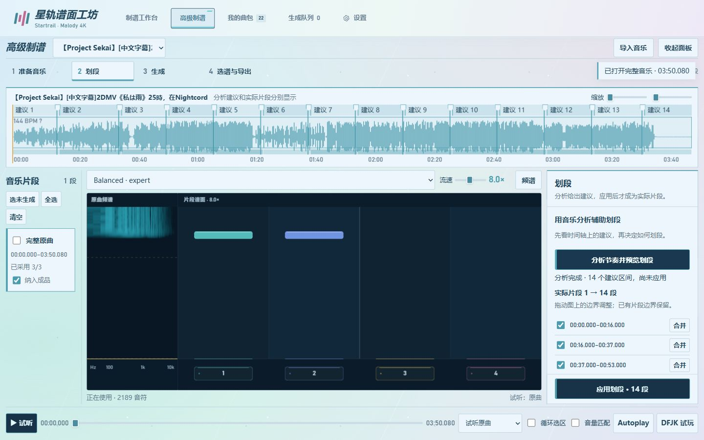
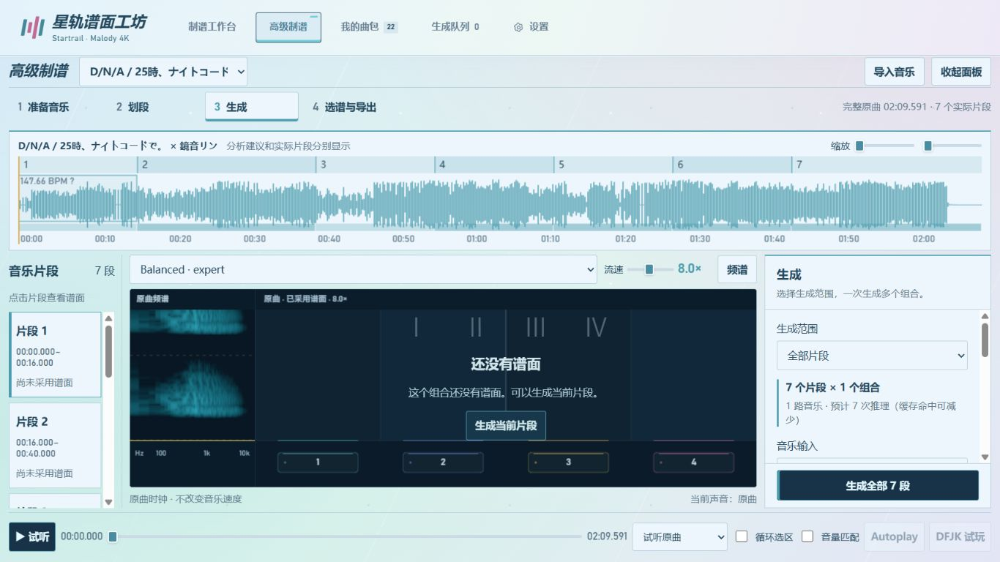
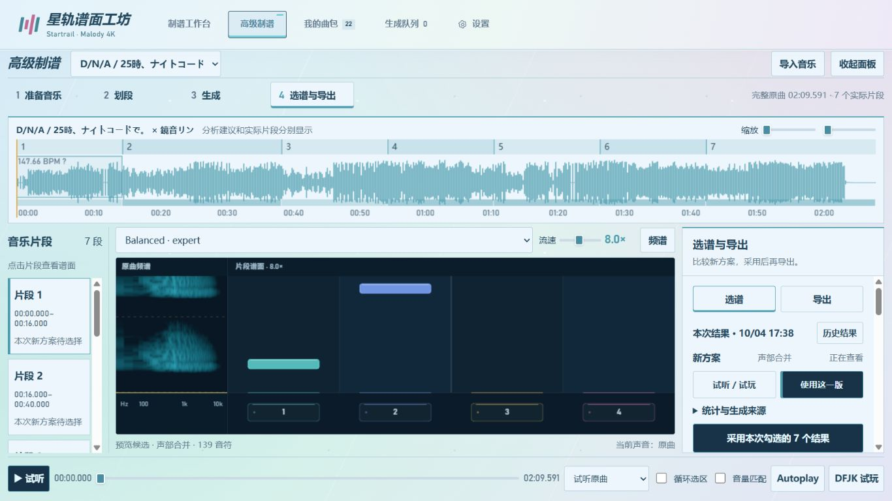
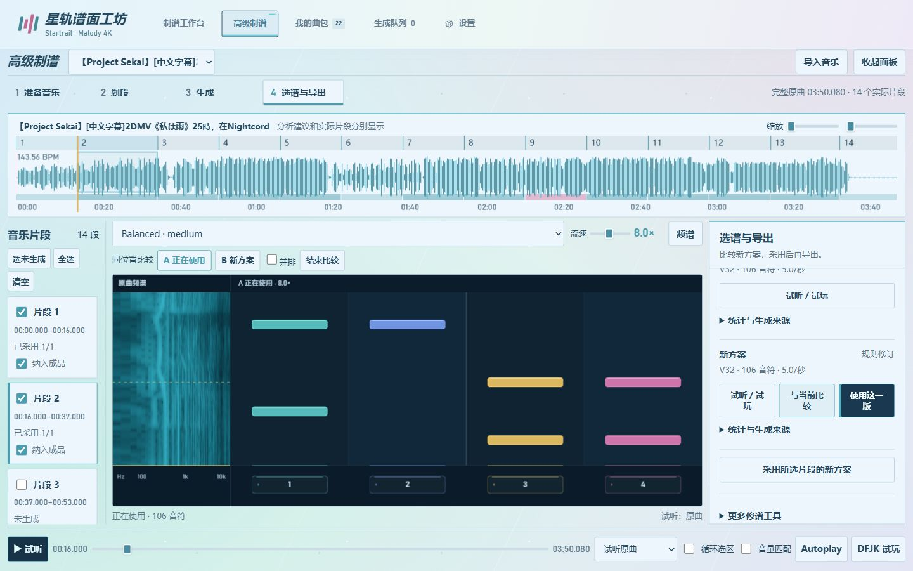
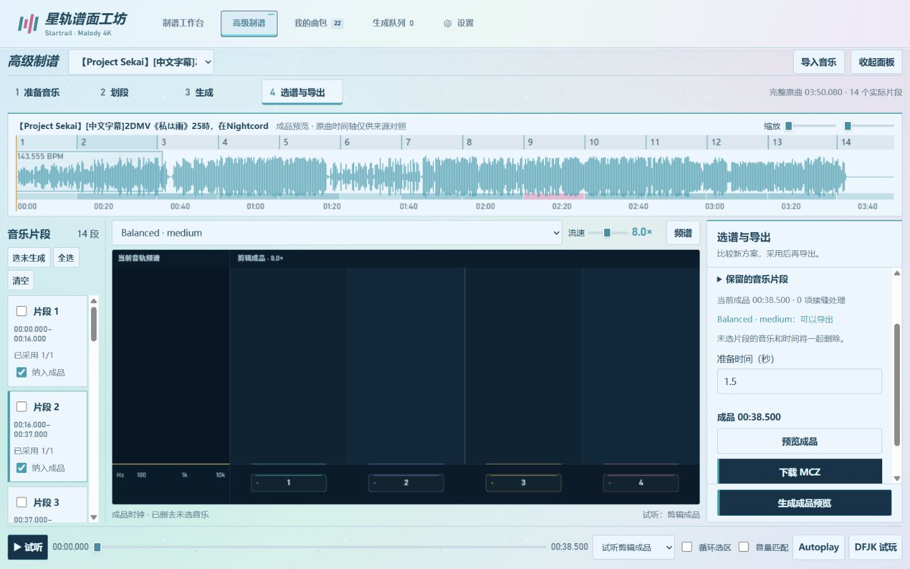
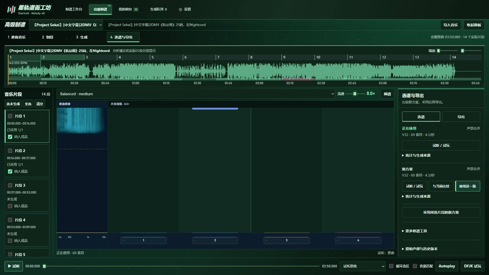

# 高级制谱：围绕完整音乐完成一张谱面

**准备音乐 → 划段 → 生成 → 选谱与导出。** 四个模式共用同一个时间轴、谱面与播放器。切换模式只更换右侧操作面板；模型任务继续运行。

## 1. 准备音乐

打开「高级制谱」，从音乐库导入完整音乐，或上传音乐／MCZ。只导入音乐也能开始：没有谱面的组合显示空轨道，原曲始终可以完整试听。导入 MCZ 时，已有谱面成为初始版本。

需要声部分离时，选择 Demucs 或 Kim RoFormer，点击「分离完整原曲」。阶段进度、失败原因和重试入口显示在此面板，关闭面板不会取消任务。结果列表保留各模型版本。

底部的「试听音轨」控制你听什么，可拖动时间、循环当前范围、同位置切换声部和匹配试听音量。「生成用哪路音乐」控制模型读什么；切换试听不会改变制谱输入。全流程共用一个音乐播放器，试玩期间由游戏接管播放。

## 2. 划段

点击「分析节奏并预览划段」。分析建议直接画在完整原曲时间轴上，右侧显示应用前后的实际片段数量。**建议尚未应用时，片段列表不会被悄悄改变。**

拖动建议边界调整位置，或用「合并」删除尚未采用的建议边界。已有片段边界标为保留，不提供无效的合并按钮。当前布局已符合建议时，直接进入生成即可。

确认后点击固定在面板底部的「应用划段」。一次性创建真实片段，保留已有边界、未选间隔、旧谱面及候选历史；需要时可整次撤销。没有谱面时也能按建议创建所有片段。

也可以在波形上拖动范围，使用侧面的开始／结束时间、当前位置按钮、保存片段和拆分。时间显示为分、秒与毫秒，内部使用整数采样位置。每段至少 250 ms，相邻允许、重叠禁止。「纳入成品」在导出面板中设置，不与生成范围混用。

节奏活动条表示相对疏密，不能直接理解为主歌、副歌或新的 BPM。BPM 参考单独编辑；应用划段不会接受拍速估计，也不会移动音符。[节奏与难度适配](adaptive-sections.md)

## 3. 生成

依次选择 **生成范围 → 音乐输入 → 排键与难度**。生成范围默认「全部片段」，主按钮显示实际数量，例如「生成全部 7 段」；也可选择「当前片段」或展开「指定片段」。左侧列表只负责定位和切换预览，不决定生成或导出的范围。

提交前显示片段数、谱面组合数、声部数和估计推理次数。接受提交后立即反馈「已加入队列」，片段分别显示排队、执行、成功或失败。任务失败不阻塞其他片段；提交设置冻结，之后修改参数不串入已经排队的任务。连续任务复用常驻 GPU 模型，空闲 15 分钟释放；设置中可主动释放显存。[常驻推理与实测](gpu-resident-inference.md)。新任务记录完成推理、重试、原谱复用和处理耗时，旧记录没有这些数据时不补造数值。

生成面板只显示本次批次的紧凑进度，推理次数和耗时放在任务详情中。重新打开旧项目保留正在使用的谱面，旧候选和旧完成卡不会混进这次操作。

两路生成默认产出合并候选；人声原谱、伴奏原谱收在生成详情中。融合失败时保留成功的原谱，可在修谱工具中重新融合，不必再次推理。独立生成和母谱快速分层、窗口粒度、种子、难度条件等放在可展开的模型设置中。

模型设置可以保存为项目模板，或仅保存到当前片段；已有片段的独立设置优先，恢复继承不会改写旧谱面。玩法与排键×难度组合仍在项目级管理。[声部生成与融合](stem-generation.md)

**所有批量新结果先进入候选区，不自动替换正在使用的谱面。**

批次结束时，若仍停留在该项目的生成页且没有试听或试玩，自动打开本次结果。正在播放、试玩或已切换位置时，只显示持续的「查看本次结果」入口，不打断操作。

## 4. 选谱与导出

打开本次结果后，默认预览第一份成功的合并谱，**不用先采用才能看谱**。按片段和组合列出本批结果，标明「正在查看」「已采用」或失败原因；失败项不会借用旧候选填充。先用底部试听／试玩，再比较，最后点击「使用这一版」。也可以单独勾选需要的结果，点击「采用本次勾选的 7 个结果」等显示确切数量的按钮。这些勾选与生成范围独立。

来源标签区分模型生成、声部合并、规则修订、Agent 修订和导入谱面。两路原谱位于各片段的「生成细节与两路原谱」中。「历史结果」可打开旧批次；更早的单独版本标为「历史方案」，明确选择后可以恢复。

A/B 默认在一张大谱面上切换，音乐位置不变；需要时勾选并排。差异用新增、删除和调整标记显示，问题报告可跳转到对应时间。只有一个版本时不显示 A/B 评价。

「更多修谱工具」提供规则处理、声部合并和 Agent。Agent 需要自行配置 API；审核窗口默认 12 秒，结果可按建议组保存为新方案，仍需试听后手动采用。密钥由本地后端持有，可选 Windows 用户加密保存；不写入曲包或浏览器偏好。这里不会混入音频分离任务。

转到「导出」，检查保留片段和缺失组合，点击「生成成品预览」。成品只使用已采用版本，音乐与音符一起移除未选区间；缺少版本的组合明确列出，不用空谱补齐。成品时钟与原曲来源时间轴分别标识。

默认准备时间 1.5 秒，可设为 0～3 秒。连续片段的长条按接缝规则延续；跳过区间时裁尾，过短的尾部转为普通音符并记录。最终 MCZ 保持经典 Malody 的 `0/`、OGG Vorbis 与 MC 结构。[完整时间与版本规则](advanced-authoring-and-agent-requirements.md)

## 试听、试玩与屏幕布局

打开合并谱面默认听完整原曲；人声、伴奏原谱分别播放对应声部。底部「当前声音」始终显示实际来源。手动切换声部时标明「单独试听」，只影响当前结果；切换候选或 A/B 后恢复该版本默认音源并保留位置。频谱、试听、Autoplay 和 DFJK 试玩使用相同来源，任意时刻最多一路音乐播放。

底部统一控制试听、时间、循环范围、试听音轨、音量匹配、Autoplay 和 DFJK 试玩。Esc 暂停，空格不控制游戏；流速 1～16× 只影响画面。Autoplay 是演示，不作为玩家成绩。

桌面时间轴与谱面固定在视口内，操作面板独立滚动，可收起；手机正常纵向排列。五种主题和四轨独立颜色保留。

## 完成记录在哪里

打开「生成队列 → 完成记录」。每次高级提交汇总为一条，可按曲名搜索、按任务类型筛选，每页 10 条。「查看结果」直达确切批次；「打开所在文件夹」打开项目结果目录，任务详情可打开单项任务目录。单曲制谱仍跳转已有曲包，分离记录跳转对应分离结果；高级候选不冒充成品曲包。完成拼接后，成品会进入「我的曲包」，可按「高级制谱」筛选，并从卡片预览该成品或下载 MCZ。

自动检查、浏览器操作和真实 Malody 导入／人工手感验收分别记录，不用音符数量或告警减少替代谱面质量结论。[结果交付与试听验证记录](advanced-result-delivery-validation.md)

## Quick start in English

1. Import complete audio or an MCZ into **Advanced authoring**. Empty music projects do not need a pre-generated chart.
2. In **Segment**, analyze, preview the suggested cuts, adjust them on the timeline, then explicitly apply them. Existing boundaries and older chart versions stay preserved.
3. In **Generate**, choose all/current/custom segments, the model input, patterns and difficulties. Submit once; background jobs freeze their settings and produce candidates. Dual stems default to a merged candidate. Open this batch's results without first adopting them.
4. In **Select & export**, audition and compare the current and proposed chart on one clock. Explicitly adopt the preferred versions, preview retained music, then download MCZ. Missing versions are listed rather than replaced with empty charts.
5. The bottom player owns music playback; DFJK and Autoplay take over that same slot. Esc pauses, Space does not control gameplay, and scroll speed changes visuals only.
6. **Generation queue → Completed records** keeps searchable, paginated records. Open the exact batch, select the desired results, then explicitly adopt them. Merged charts play the original music; raw charts play the corresponding stem. Manual listening overrides reset when selecting another chart.

Detailed model parameters, stem originals, history, rules and Agent tools are secondary disclosures. API credentials stay in the local backend; cloud reviews require your configured service.

## 连续预览与成品版本（2026-10-04）

普通试听沿完整原曲连续播放：到达下一个实际片段时，左侧选中项和谱面自动接续，不重新加载音乐。同批候选接续同批结果；声部原谱接续同声部，缺失结果不会借用旧候选。循环选区和 A/B 比较保留当前片段。DFJK 和 Autoplay 仍按当前试玩范围运行。

导出面板只展开一份当前成品，旧版收进“历史成品”，显示创建时间。相同原曲、片段范围、采用版本、节拍参考和准备时间会复用成品；改变内容后保存新版本。重复请求也不会并行创建相同文件。

高级成品的 MCZ 内部使用短英文文件名，完整曲名保留在谱面元数据及下载文件名。历史曲包下载时生成单独的兼容副本，不修改原始音频、谱面和存档。实际 Malody 导入仍需与自动格式检查分别验收。
