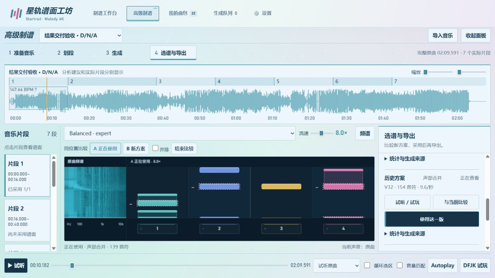
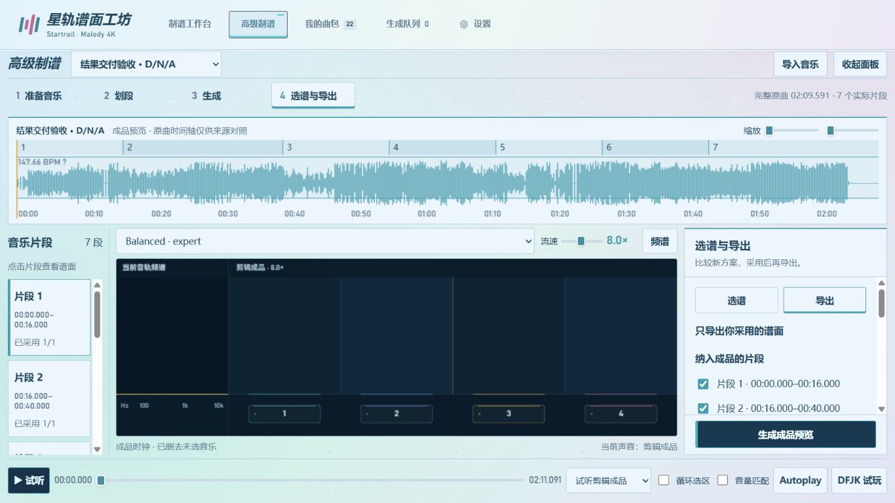

# 高级制谱结果交付与试听来源：验证记录

日期：2026-10-04。正式服务为本机 8766，工作流版本 7、完成记录版本 1。此次修复结果交付、批次归属和播放来源，未改生成模型、声部分离算法或已有音符。

## 交付流程

- 左侧片段列表只定位；生成范围在右侧选择全部／当前／指定，默认全部。
- 本次提交只显示紧凑进度；前台未被打断的生成完成后打开结果，其他情况保留查看入口。
- 本次结果按确切批次列出，预览与采用分开。两路原谱放在详情，统计也按需展开。
- 队列增加每页 10 条的完成记录，支持搜索、任务类型筛选、准确结果跳转和身份限定的文件夹入口。
- 合并谱默认播放原曲；声部原谱播放对应声部。手动试听覆盖只属于当前候选，换版或切换 A/B 即恢复默认。

## 自动检查

相关后端 **82 项通过**，相关前端 **54 项通过**，合计 **136 项**；脚本语法检查通过。这是本次关联范围的回归，未冒称全仓库测试。

| 范围 | 覆盖 |
|---|---|
| 任务与版本 | 旧记录准确关联、不改不可变原谱、缓存复用、真实交付结果、部分失败、重试替代与历史保留 |
| 候选选择 | 只采用所勾选批次的有效主结果；不存在、范围过期、失败项、旧候选和其他组合不能混入 |
| 完成记录 | 10 条分页、搜索、类型与项目筛选、过期响应隔离、展开状态保存、文件夹身份与目录校验 |
| 音源 | 合并原曲、人声／伴奏默认值、当前结果的手动覆盖、A/B 恢复默认、旧请求与项目切换隔离 |
| 游戏回归 | 单音乐源、Autoplay、Esc 暂停、倒计时、长条、Combo、结算、退出和重开 |

部分失败与异常输出通过模拟数据检查，不为测试故意破坏用户任务；没有发出付费 Agent 请求。文件夹测试使用受控系统打开函数验证身份和目录，不以字符串路径从浏览器指定任意文件夹。

## 用户保存结果的真实接口复核

只读复核 D/N/A 的最新完整批次，原项目清单前后字节一致：

- **7 个完成任务，21 个实际版本，7 个主要合并候选**。
- 合并候选音符头数依次为 139、310、172、204、185、206、265，仅用于确认版本身份，不作为质量评价。
- 逐一读取 21 个版本：7 个合并版本的 `audio_source_id` 均为 `original`，14 个声部原谱分别指向自己的音源。
- 项目准确关联 3 个旧批次，不使用时间接近或缓存任务身份猜归属。
- 服务重启后读取既有完成记录：共 80 条、8 页，前两页各 10 条，记录身份没有重复。
- 没有代替用户采用候选、重生成音乐或创建成品。

## 浏览器操作

在正式工作台验证：

1. 重新打开 D/N/A，生成范围为全部 7 段；左侧没有生成勾选框，生成面板没有旧完成卡。
2. 当前／指定范围正确改变主按钮与数量预览，生成范围转换另由自动测试覆盖。
3. 完成记录第二页显示 `2 / 8`；搜索 D/N/A 并筛选高级制谱，得到 6 条记录。从最新记录直达确切 7 段批次。
4. 未采用也能预览第一份合并谱；查看人声、伴奏原谱后返回合并结果，声音恢复原曲。手动改听伴奏时标明「单独试听」，换候选后覆盖失效。
5. 合并谱的 Autoplay 和 DFJK 使用原曲；人声、伴奏原谱分别使用相应声部。检查 DOM 音乐播放状态，最多一路音乐播放，暂停和退出后全部停止。
6. 使用独立验收项目复制真实音符和 PCM，浏览器手动恢复历史版本、比较真实旧候选。A/B 切换前后保持原曲 **10.18183 秒**位置；历史候选明确显示恢复按钮。
7. 测试副本先只采用 1 段，导出提示缺少 6 段；通过真实批量采用接口补齐全部版本后，从浏览器生成成品预览和下载入口。
8. 从成品返回或切换项目后，清除旧成品时钟说明和音源状态，不让旧界面文案误导当前预览。

## 导出验证

独立验收项目保留 D/N/A 全部 7 段，加 1.5 秒准备时间，使用原曲而非声部音频：

| 项目 | 实测 |
|---|---|
| 成品时长 | 131.090589569161 秒 |
| OGG 解码 | 5,781,095 个采样帧，44.1 kHz、双声道，与采样映射一致 |
| MCZ | 经典 `0/` 结构、Vorbis 音频、背景图与曲名＋模型＋排键＋难度命名 |
| 谱面 | 1,481 个音符头，结构校验通过 |
| 时间回读最大误差 | 0.015093 ms，小于 1 ms |
| 接缝 | 本例连续全曲，无需接缝修正 |

这是文件与时间验证，本轮没有在实际 Malody 客户端进行人工手感验收，也没有重新运行 GPU 制谱或评价声部分离质量。

## 布局

| 视口 | 整页尺寸／行为 | 谱面与面板底部 |
|---|---|---|
| 1366 × 768 | 1366 × 768，无新增整页滚动 | 均为 694 px |
| 1440 × 900 | 1440 × 900，无新增整页滚动 | 均为 826 px |
| 1920 × 1080 | 1920 × 1080，无新增整页滚动 | 均为 1006 px |
| 390 × 844 | 正常纵向排列，无横向溢出 | 按移动布局排列 |

完成记录的搜索按钮保持单行；后台刷新不会使已有记录周期性变淡。主要结果操作优先显示，统计收进详情。既有主题和四轨配色继续使用原主题变量。

