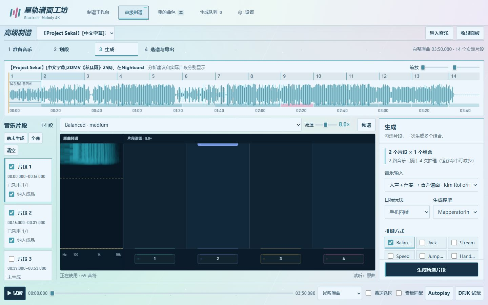
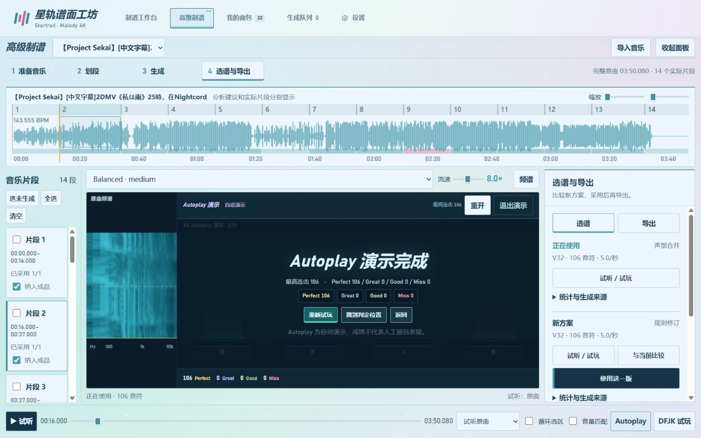
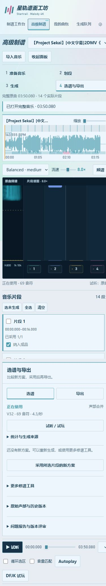

# 高级制谱台重构：验收记录

日期：2026-10-04。正式入口为「高级制谱」，工作台使用 **准备音乐、划段、生成、选谱与导出** 四个模式。完整原曲时间轴、谱面和播放器常驻；右侧面板更换操作内容，主要操作固定在面板底部。

## 自动测试

后端完整回归 **314 项通过**；前端完整回归 **82 项通过**。最终异步交互调整后，相关前端测试再次运行，**35 项通过**，脚本语法检查通过。

新增和关联检查覆盖：

- 分析预览不改项目；原子应用、整次撤销、历史保留、人工边界和未选间隔。
- 整数采样、半开区间、至少 250 ms、长条跨界信息和继承版本重新评审。
- 生成中的片段不能改范围；项目版本冲突与写入失败不留下部分应用的项目清单。
- 多片段批次先完整校验，再进入原有队列；重复提交使用请求标识恢复原任务，输入与设置冻结。
- 新候选不自动采用；批量采用先验证全部选择，原始声部与主要候选分别展示。
- 旧请求不能覆盖新的项目、片段、组合或候选；较旧任务轮询结果不覆盖新项目清单。
- A/B 差异、共享频谱投影、音量匹配、长条、Combo、暂停、音效与播放器隔离。
- 实际推理、有限重试、V32 合并请求和缓存复用分别统计；旧记录缺少指标时不补造。

这些测试验证程序行为，不评价音乐采音和排键是否好玩。

## 真实接口与模型闭环

使用《我是雨》的完整原曲创建独立验收项目，不修改用户原项目的已采用谱面：

| 环节 | 本轮实际结果 |
|---|---|
| 只导入音乐 | 230.080 秒，10,146,528 个采样帧；初始没有片段或谱面，可完整试听 |
| 节奏分析 | 14 个建议区间；预览显示草稿，尚未改变实际片段 |
| 应用划段 | 浏览器明确应用，实际片段从 0 变为 14，立即显示在列表和时间轴 |
| 声部分离 | 复用同一完整音源、同一参数的 RoFormer 缓存；本轮没有重新测量 RoFormer 全曲 GPU 推理时间 |
| 批量制谱 | 多选 0–16 与 16–37 秒，V32 / Balanced / Medium，两路声部独立推理并完成融合 |
| 推理记录 | 每个片段两次主推理、一次有限重试、一张融合候选；依据本轮实际推理产物复核 |
| 候选选择 | 人声原谱、伴奏原谱、合并候选均保留；生成结束后两个片段的采用项仍为空，随后在浏览器手动采用 |
| 局部再处理 | 保存规则修订候选；比较和预览不替换已采用版本 |
| 缓存再生成 | 两路原谱复用，模型推理与重试均为 0，融合候选 1，任务约 1.25 秒；已采用版不变 |
| 成品 | 保留前两个片段共 37 秒，加 1.5 秒准备时间，成品 38.5 秒，175 个音符头 |

任务是独立调度的叶任务，没有父任务占着 GPU 等待子任务。上述数量只证明执行、候选和采用路径，没有用音符数量评价融合质量。

## 浏览器交互

在正式内置浏览器与当前 8766 服务中完成：

- 完整音乐空谱开始、分析、预览建议、应用真实划段、多选提交、候选手动采用、成品预览及下载入口。
- 用户原《我是雨》项目保持一个实际片段和原来的采用版本；只预览 **1 → 14** 的建议，没有代替用户应用。原谱不需重新生成也能打开。
- 建议边界通过键盘移动 1 ms，再合并为 13 段；重新分析恢复 14 段草稿。修改草稿没有改动用户原片段。
- 加载期间允许切换工作模式；打开项目完成后保留当前模式。音乐与候选尚未就绪时操作区暂停交互，避免提前提交后被加载响应覆盖。
- A/B 默认单谱面切换，真实修订前后保持同一音乐位置；原谱细节不混入音频分离任务。
- 同位置切换原曲、人声和伴奏，最多一路音乐在播放；试听音轨与生成输入分别选择。
- 声部加载途中按 Esc，加载完成后不会自行恢复播放；音源切换中时间位置不短暂回到 0。
- Autoplay、暂停、退出、长条与结算复核。16–37 秒片段的自动演示结果为 **106 Perfect、0 Great、0 Good、0 Miss，最高 Combo 106**。这是自动演示，不是人工试玩成绩。
- 最终页面未记录 JavaScript 错误；当前服务队列空闲，工作流版本为 6。

## 导出与时间精度

成品 MCZ 独立解包、解码并检查：

- 使用兼容的 `0/` 结构，包含 `audio.ogg`、背景图和「曲名＋模型＋排键＋难度」命名的 MC。
- OGG 解码得到 **1,697,850 个采样帧、44.1 kHz、双声道**，等于实际 38.5 秒；浏览器元信息显示约 38.5029 秒，不作为采样映射精度。
- MC 结构校验通过，175 个音符头尾还原后与成品映射最大误差 **0.0010402 ms**，小于 1 ms。
- 只采用确认版本；不把缺失片段或未采用候选当作可导出的空谱。
- 当前实曲成品验证连续接缝；跳过中间区间、非整拍切口、跨界长条、空谱段和范围过期由自动测试覆盖。

## 布局与主题

浏览器实际测量如下；右侧内容内部滚动，主要操作与统一播放器保持可见。

| 视口 | 整页尺寸 | 谱面与面板底部 | 结论 |
|---|---|---|---|
| 1366 × 768 | 1366 × 768 | 均为 694 px | 无新增整页滚动 |
| 1440 × 900 | 1440 × 900 | 均为 826 px | 无新增整页滚动 |
| 1920 × 1080 | 1920 × 1080 | 均为 1006 px | 无新增整页滚动 |
| 390 × 844 | 内容纵向约 2054 px | 正常纵向排列 | 无横向溢出 |

浅色、桃色、月色、海色、暗色五种主题均检查。四轨颜色独立，正文与时间可读，使用实底面板。验收后恢复原浅色主题与正常浏览器视口。

## 尚需人工验收的项目

没有把自动测试、MCZ 校验或 Autoplay 当作实际 Malody 手感验收。本轮未在手机 Malody 试玩新版曲包，未完成至少 20 组人工 A/B 质量评价，也未调用用户付费 Agent API。MuG 和云端接口的回归由测试覆盖，不能冒称此次全部重新运行了真实推理。

串音、采音贴合、排键意图、难度一致性和接缝体验仍需用户试听、试玩。自动评审不产生未经验证的质量总分或官方等级。

本轮详细本地记录位于忽略目录 `work/workbench-validation.json`，用户音乐和模型产物不随文档截图分发。此前七步骤版本的浏览器与导出证据留在原有本地记录中，本页记录当前四模式工作台。
