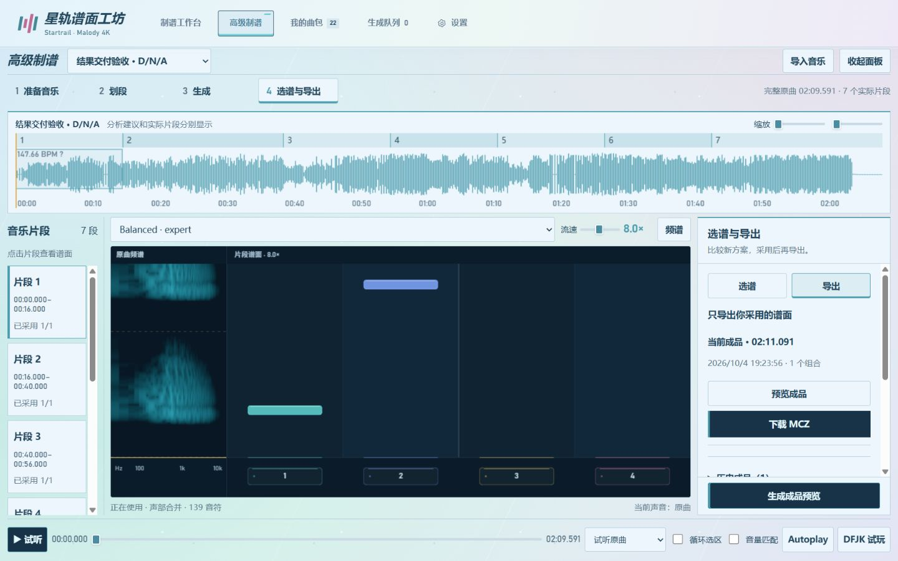

# 连续预览与成品导出验证

日期：2026-10-04。

- 自动检查：56 项 Python 测试、58 项 Node 测试通过。覆盖重复与并发导出、内容改变后的版本、ASCII 包内路径、历史兼容副本保留原音符与音频、半开片段边界、同批候选隔离、声部匹配和片段间空隙。
- 本机新版后端 8767：独立 QA 项目连续两次导出返回相同 ID，第二次明确 reused；历史 D/N/A 成品下载包含 `0/`、`audio.ogg`、背景图和 `balanced--expert.mc`，CRC 检查通过。
- 浏览器 8766：独立 QA 项目从约 13 秒开始播放，实际跨过 16 秒、40 秒边界，自动选中片段 3，显示 172 个音符；音乐源 URL 保持不变，播放器持续运行。
- 当前成品单独显示，历史折叠且附创建时间；修正任务轮询重建列表导致的滚动漂移。
- 两份用户旧成品保留，修正版位于各自 `compatibility-v2` 目录，并将最新兼容曲包提供为 `DNA-4K-Expert-compatible.mcz`。
- 尚未证实 Malody 导入失败的精确原因；包内 Unicode 文件名是与早期已确认可导入曲包的差异之一，已恢复短英文路径。不能将 ZIP、MC 和 OGG 校验等同于实际游戏导入成功。
- 正式后台仍是旧进程：自动审批拦截了停止进程并重启操作；新后台在 8767 验收，正式 8766 需要按通常启动方式重启以启用后端改动。新版前端刷新即可生效。

