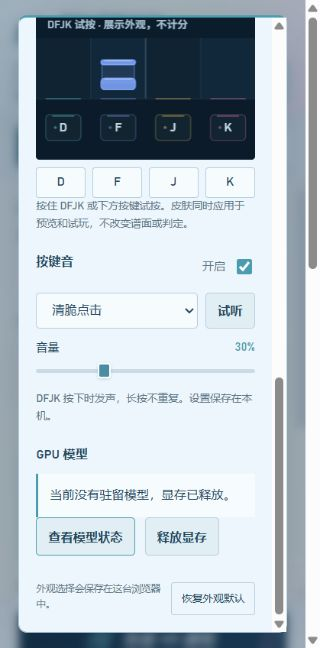

# 常驻 GPU 制谱

连续制谱默认复用已加载的 V32 或 MuG 模型。任务结束保留权重；新任务使用独立输入、设置、种子和输出。人声、伴奏、排键与难度之间可以共享模型加载结果，谱面候选和采用规则不变。

## 使用与释放

- 不需额外配置，现有单曲与高级制谱入口都使用常驻推理。
- 同模型请求依次执行；CPU 准备和后台队列仍使用原有流程。当前不是同时调用同一个模型做并发解码。
- 切换 V32／MuG，或真正运行声部分离时，先退出上一套驻留模型，避免显存互相挤占；直接使用分离缓存不需要释放模型。
- 空闲 15 分钟自动退出，可在「设置 → GPU 模型」查看状态或主动释放显存。推理时拒绝释放，不中断当前生成。
- 模型代码或权重文件更新后，下次请求重启驻留进程。CUDA 不可用时明确失败，不自动改为 CPU 推理。
- 单个请求异常会清空模型与临时 GPU 状态，后续请求重新加载；进程崩溃则当前请求失败，重试时启动新进程。不会自动重放一个执行情况不明确的请求。

## 状态与耗时

高级台任务显示模型热复用次数、权重加载、主推理、重试和融合耗时。详细记录包含驻留进程 PID、显存峰值和本次请求时间。V32 主推理计时包含该调用的音频预处理；另记录音频解码时间，不把它重复相加到总耗时。

MuG 的请求间只传递独立的本地音乐特征文件。各任务的潜变量长度在采样前重设，避免不同曲长串扰；卸载任务只删除该任务特征，模型继续驻留。

## 本机短片段实测

2026-10-04，当前 RTX 4080 SUPER，6 秒实际音乐片段。以下是一次测试，不是所有歌曲的加速承诺。

| 模型 | 冷请求 | 热请求 | 验证 |
|---|---:|---:|---|
| V32 | 17.235 秒 | 同种子 4.859 秒 | 相同 PID；热请求权重加载 0 秒；相同种子音符与节拍一致 |
| MuG，20 步 | 18.391 秒 | 同种子 2.765 秒 | 两次共四个操作使用相同 PID；模型复用；相同种子 78 个音符的头、尾、轨道一致 |

V32 另一个不同种子的热请求为 4.266 秒。冷请求包含 Python／模型环境启动与初始化，不能把它们全部称为权重加载；这次 V32 权重加载约 1.14 秒，MuG 约 7.55 秒。

真实测试确认了模型切换和主动释放退出进程。异常、锁竞争、请求隔离由回归测试补充。普通硬件基准禁用驻留，避免两个压力测试请求被服务串行化后误报通过并发测试。

正式高级台 API 另提交了《我是雨》的两个片段（0–16 秒、16–37 秒，V32 Medium，原曲输入）。两项均成功，驻留 PID 都为 40500；第二项同时复用制谱和节拍模型，权重加载 0 秒。第一项请求 82.843 秒，第二项 21.922 秒；片段长度不同，不能用这两个数字计算加速倍数。各项目已采用版本逐项核对未变。设置页已验证忙碌时拒绝释放、完成后正常释放。

自动验证：全套 Python 回归 323 项通过；新增耗时汇总用例及驻留用例共 8 项通过；时间轴 JavaScript 回归 11 项通过。硬件测量、后台队列验收和网页操作分别记录，不代表实际 Malody 试玩验收。

本地原始测量在忽略目录 `work/resident-benchmark/`。性能测量不评价谱面质量，也没有修改用户已采用谱面。

## 后端维护

`GET /api/gpu/resident` 返回驻留状态；`POST /api/gpu/resident/release` 在空闲时释放，忙碌返回 409。通信使用项目本地文件和跨进程独占锁，不开放额外网络端口。

当前进程 PID 与会话标识共同区分服务实例；请求结果使用独立 ID。不要手动删除正在使用的 `cache/resident-gpu` 或特征文件。任务失败后可按原有入口重试。
