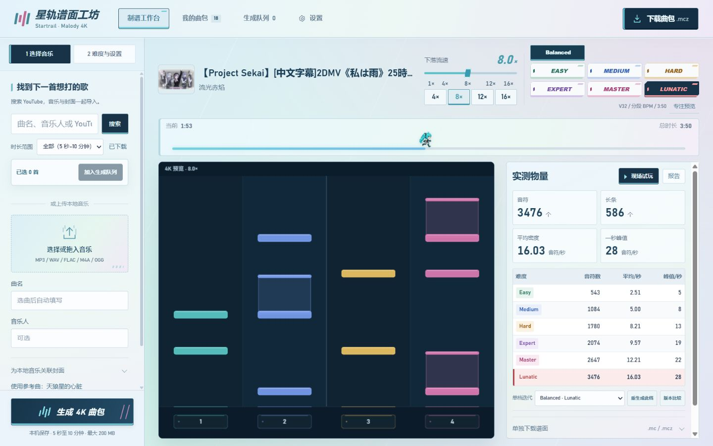
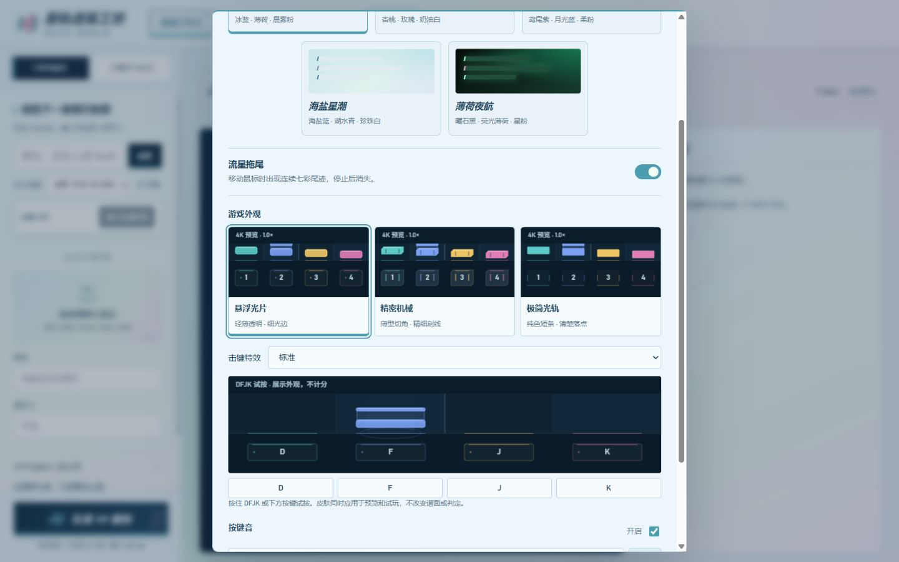
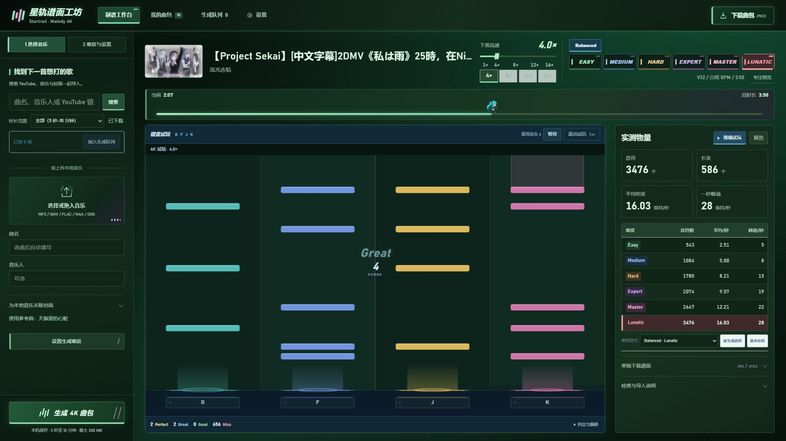

# 星轨谱面工坊：判定区、皮肤与流速升级

日期：2026-10-03

状态：已集成正式工作台，完成本地功能和浏览器验收。旧版梯形承台 Demo 已被替换。

## 1. 本轮需求和决策

- 保留已认可的连续七彩鼠标拖尾及克制的按压反馈。
- 下落流速扩展为 1–16×，0.1× 步长；刻度不小于 13 px，快捷按钮字体 14 px、操作高度不小于 32 px。
- 重做判定区，放弃厚重梯形底座、斜面塑料质感和大面积立体渐变；同步调整配套音符。
- 三套风格全部提供，在设置中选择整套皮肤，同时更换音符、长条和判定区。默认悬浮光片，特效默认标准。
- 正式预览和 DFJK 试玩共用绘制组件。生成模型、音乐速度、音符时间、判定窗口、Combo 和 MCZ 格式不因外观改变。

## 2. 三套配套外观

| 套装 | 判定区 | 普通音符与长条 |
| --- | --- | --- |
| 悬浮光片，默认 | 薄透明面板、细高光、弱轮廓与轻微落点标记；无厚底座 | 薄实体光片与微圆角；长条淡色身体、独立头尾与持键加亮 |
| 精密机械 | 薄型切角面板、左右细刻线、按下小幅位移 | 切角短条、局部结构线；长条沿用同一套头尾轮廓 |
| 极简光轨 | 短判定线、低填充、局部边缘；降低底部按键存在感 | 纯色短条与最少装饰；身体与端点仍清楚 |

四轨颜色固定为青 `#62D6D1`、蓝 `#83A7FF`、金 `#FFD166`、粉 `#EF83BF`，独立于网页主题。五种网页主题不会把轨道变成同色。

统一几何：Canvas 顶部信息区 28 px，底部判定区 64 px，实际判定线为 `height - 64`；皮肤不改变这个位置。音符宽度为轨道宽度的 64%。每轨按相邻音符时间间距自适应音符高度，范围 3.5–15 px，避免高密度时互相覆盖。底部标签至少 13 px，预览为 1–4，试玩为 DFJK。

长条的头部命中后继续保留身体，持键头部贴合判定线，身体和侧边稳定亮起；尾部完成和提前断连规则保持不变。中央判定在 Combo 上方，保留现有字号关系和小幅弹出动画。

## 3. 控件与空间分配

流速控件保留在曲名区域、难度按钮左侧：斜体倍率读数、青色填充、切角滑块、1 / 4 / 8 / 12 / 16× 刻度及 4 / 8 / 12 / 16× 快捷按钮。不在谱面下方新增工具栏。

桌面流速控件最小宽度 180 px。较窄桌面中曲名省略并保留完整名称提示，难度在现有标题区域内排列。排键超过三个，或多排键所在区域不足 260 px 时，切换为紧凑选择器，避免无限换行；手机保持正常纵向布局。

在 1181 px 以上桌面使用现有固定视口和弹性布局，谱面与右侧面板底部对齐。右侧信息较多时沿用面板内部滚动，不将整个工作台拉长。

流速继续采用 `travelMs = 5000 / speed`，16× 为 312.5 ms 的显示行程。这里是工具的视觉标尺，不宣称等同于任意 Malody 客户端的数字。旧 1–12× 偏好原样保留，异常输入按新范围归一化。改变流速不改变音乐播放和判定。

## 4. 设置、反馈和兼容

设置增加“游戏外观”：三个四轨 Canvas 缩略图、关闭 / 轻量 / 标准特效以及 DFJK / 按钮试按区域。缩略图、试按、预览和正式试玩使用同一个绘制组件，避免示意图与实物不一致。

外观偏好保存在本机 `startrail.game-appearance.v1`，包含 `skin` 和 `hitEffects`；独立于主题、按键音和生成参数。皮肤值为 `float` / `mechanical` / `minimal`，特效值为 `off` / `light` / `standard`。无偏好时使用新默认值；非法字段只回退对应字段。刷新后保留选择。

| 事件 | 视觉行为 |
| --- | --- |
| 真实按下 | 按键轻压、落点短闪；空按也有输入反馈 |
| Perfect / Great / Good | 当前轨道的扁平光纹；标准模式增加落点上方 65 px 的窄光柱，约 220 ms 消散 |
| 持续长按 | 面板与长条保持稳定亮起，不连续发射粒子，不重复计算 Combo |
| 尾部成功完成 | 约 140 ms 的光纹收束 |
| Miss / 提前断连 | 落点轻微暗化，无成功光柱 |
| 松开 | 回到未按状态，短闪淡出 |

效果队列最多 32 项，约 240 ms 后清理。键盘 repeat 不重复发射。暂停、失焦、退出、重开会清理；和弦每轨独立，特效只消费判定事件，不反向修改音符和计数。

七彩拖尾以约 4 px 的路径采样绘制连续渐变主线，最多 256 点，寿命 520 ms；快速宽幅移动仍连接中间轨迹，长暂停、离开窗口、失焦和排除区域重置起点。对谱面区域裁剪，时间轴 / 流速操作及正式试玩时停止发射。明暗主题调整亮度；减少动态效果时禁用。尾迹消失后停止动画循环。

## 5. 实现结构

- `web/playfield-renderer.js`：四轨配色、统一几何、间距准备、普通音符、长条、底部面板和有界短效；可由 Node 测试直接调用。
- `web/game-appearance.js`：偏好归一化、设置交互、共享缩略绘制、试按及外观变化通知。
- 预览与试玩调用同一渲染器。试玩保留原音符状态和判定流程，只在有效输入与判定完成后推送视觉事件。
- 独立 Demo 更新为三套配套风格并复用正式渲染器，不再保留旧的梯形绘制实现。
- 脚本和样式缓存版本统一更新；没有增加后端 API，不将皮肤或中间状态打入 MCZ。

## 6. 验收记录

### 自动检查

23 项前端测试与 78 项 Python 回归测试通过，覆盖现有长条、Combo、音频和退出行为，以及新增的皮肤偏好、统一几何、每轨间距、有界效果、多排键选择器、空按不假成功、重复输入不重复发射和长条效果隔离。JavaScript 语法与修改的差异格式检查通过。

### 浏览器检查

- 使用已有《私は雨》曲包检查真实六档谱面、Lunatic 预览和网页试玩。
- 1366×768、1440×900、1920×1080 下页面高度分别为 768、900、1080；谱面与右侧面板底边分别为 753、885、1060，无新增页面滚动。
- 390 px 窄屏无横向溢出；刻度为 13 px，桌面快捷按钮为 14 px / 32 px。
- 五种主题均检查控件对比度和底部对齐，修正暗色未选流速按钮的亮底问题。
- 刷新后保持皮肤、特效和流速偏好；三套风格通过实际设置入口切换。
- 真实 DFJK 输入出现 Perfect / Great 和 4 Combo；空格暂停、Esc 退出正常。长条及多押边界由上述自动测试覆盖，未据此声称完成手机 Malody 实玩。
- 本机 16× 实际谱面诊断采样：预览绘制调用 P95 约 0.20 ms，试玩约 0.50 ms，各保留 240 个样本。该数字只包含绘制函数的 CPU 调用时间，不包含完整 GPU 合成和输入延迟，也不是其他设备的帧率保证。

可选本地诊断入口为 `/?playfieldDiagnostics=1`，在轨道内显示绘制 P95 和调用间隔；默认页面不显示诊断信息，不上传数据。

### 效果图

另有 [精密机械](screenshots/playfield-mechanical-workbench.png)、[极简光轨](screenshots/playfield-minimal-workbench.png) 和 [窄屏布局](screenshots/playfield-mobile.png) 截图。

正式页面：<http://127.0.0.1:8766/>

交互 Demo：<http://127.0.0.1:8766/static/demos/playfield-design.html>。Demo 的按键模拟成功命中，供比较外观；不计真实歌曲成绩，不修改正式设置。
