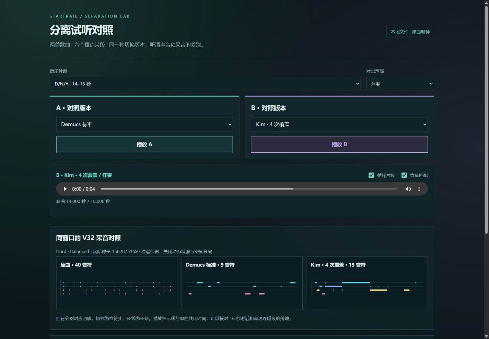
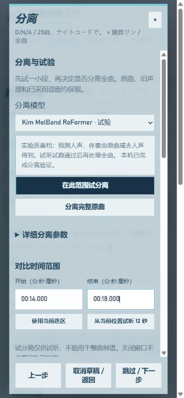

# 分离升级：2026-10-04 本地验收

Kim Mel-Band RoFormer 已安装并接入正式高级制谱台。完成两首完整歌曲的 2 / 4 次覆盖分离、六个重点窗口的音频对照、十组同种子 V32 制谱与首尾局部试验。Demucs 标准仍是默认快速档，Kim 保留试验质量档，用户比较后手动采用。

## 可直接操作的功能

- 高级制谱 → 分离：后台模型目录提供可用状态、参数边界与安装指南。Demucs 重叠比例与 Kim 覆盖次数分别显示。
- 局部试分离至少 250 ms，携带前后各 8 秒上下文，仅返回所选区间。局部结果不能用作完整制谱输入。
- A / B 版本、原曲 / 人声 / 伴奏、循环、定位拖动与可选音量匹配。始终只播放一路，换版保持原曲位置；暂停后换版保持暂停。
- 满意后处理完整原曲，明确选择完整声部作为生成输入。试听不替换已采用谱面。旧原曲、分离版本与生成结果保留。
- 任务显示阶段、实际进度、设备、耗时及显存；CUDA 不可用或显存不足时失败，不静默改用 CPU 推理。
- 新导入 YouTube 音乐优先解码保留的下载原文件。旧项目保持原音源，避免比较中途换音。

[使用与安装指南](separation-upgrade-guide.md)。独立环境的一键安装入口为 `tools/setup_roformer.ps1`，支持可信 HF 镜像和本地权重，均校验固定 SHA256。

## 可重复的实验条件

使用两个旧项目不可变的 44.1 kHz 立体声原曲 PCM，与已有标准版、FT 比较。D/N/A 为 **5,714,945 帧**；初音未来的消失为 **12,793,940 帧**。全部四次整曲 Kim 输出帧数、声道与采样率完全一致，未拉伸或裁静音。

MSST 推理代码固定 `e247dfe4abc1f17c69dff719207fe045dc04413a`；Kim HF revision 固定 `ac9b0614ab3cd7f77219e18ba494dfd93956c348`；权重 SHA256 为 `87201f4d31afb5bc79993230fc49446918425574db48c01c405e44f365c7559e`。配套窗口 **352800 样本 / 8 秒**、batch 1、CUDA AMP float16，关闭 TTA。

人声保留原始输出尺度，伴奏在试听增益之前计算为原曲减人声。分离原始结果不可变；导出的对照片段采用同一采样范围和共同防削波增益。可选 RMS 匹配只降低较响一路，不修改音频文件和模型输入。

## GPU 实测

RTX 4080 SUPER，驱动 591.86，独立 Python 3.10.19 / PyTorch 2.5.1 + CUDA 12.4。四次均通过本地队列运行，模型计算明确为 CUDA；完整歌曲的重叠累积缓冲放在系统内存。

| 音乐 | 原曲长度 | 覆盖次数 | 提交至完成 | 分离进程耗时 | 纯模型推理 | 进程峰值预留显存 |
|---|---:|---:|---:|---:|---:|---:|
| D/N/A | 129.591 秒 | 2 | 22.578 秒 | 15.812 秒 | 7.516 秒 | 2.043 GiB |
| D/N/A | 129.591 秒 | 4 | 28.609 秒 | 21.500 秒 | 13.875 秒 | 2.043 GiB |
| 初音未来的消失 | 290.112 秒 | 2 | 31.594 秒 | 23.562 秒 | 14.813 秒 | 2.043 GiB |
| 初音未来的消失 | 290.112 秒 | 4 | 43.891 秒 | 38.032 秒 | 29.156 秒 | 2.043 GiB |

提交至完成包括队列派发、环境启动、分离与完整性检查；不是纯推理时间。PyTorch 峰值已分配显存为 **1.942 GiB**，预留为 **2.043 GiB**。独立外部采样观测整卡占用最高 **5908 MiB**，最少剩余 **10468 MiB（约 10.22 GiB）**，超过 2 GiB 余量要求。外部采样间隔为 3 秒，属于采样峰值，不声称捕获了每一个瞬时峰值；进程另记录 50 ms 间隔的 CUDA 余量及 allocator 峰值。

## 六个片段的客观变化

下面是伴奏 20–200 Hz 能量占已测 20–16000 Hz 频带能量的比例。它用于定位低频偏重，不是串音率或分离质量分。

| 窗口 | Demucs 标准 | Demucs FT | Kim 4 次覆盖 |
|---|---:|---:|---:|
| D/N/A 14.0–18.0 秒 | 90.9% | 91.6% | 87.7% |
| D/N/A 38.0–54.0 秒 | 66.7% | 68.6% | 63.7% |
| D/N/A 110.0–126.0 秒 | 66.4% | 68.7% | 70.4% |
| 初音未来的消失 14.0–20.0 秒 | 7.6% | 8.2% | 7.6% |
| 初音未来的消失 28.0–44.0 秒 | 59.0% | 58.9% | 54.0% |
| 初音未来的消失 148.0–164.0 秒 | 59.8% | 60.3% | 55.4% |

- **D/N/A 14–18 秒：** Kim 伴奏低频占比下降，人声 RMS 与标准版相近。保留原曲一起比较高频细节、漏入的人声与鼓点；不能只按比例判断“更干净”。
- **D/N/A 38–54 秒：** Kim 低频占比下降、伴奏 RMS 略升，值得对照乐器瞬态和串音。
- **D/N/A 110–126 秒：** Kim 低频占比反而更高、人声 RMS 也更高，说明变化并非每段都朝同一方向；尤其要听和声是否更完整、是否把乐器带入人声。
- **初音未来的消失 14–20 秒：** Kim 人声几乎为空，标准版人声也很弱，FT 的人声能量更高。应对照原曲确认是否属于正确排除伴奏，而不是把弱人声漏掉。
- **初音未来的消失 28–44 秒：** Kim 伴奏低频占比下降，人声和伴奏 RMS 均略升。重点检查高速辅音、叠轨和鼓点，不把更响误当成更清楚。
- **初音未来的消失 148–164 秒：** Kim 人声 RMS 约 0.0102，标准版约 0.0346。可能是减少乐器误提取，也可能是人声损失，需要原曲 / 人声 / 伴奏逐路听辨。

Kim 两路重组相对 RMS 约 `2.2e-8`，这是伴奏由减法构造的数值一致性结果，不能证明串音为零。没有真实独立声部参考，未计算或编造 SDR。以上逐片段结论是可验证的信号差异；听感与音乐语义验收仍需人工 A/B。

## 同种子制谱对照

通过已部署队列实际运行 V32，Hard 独立原谱、关闭动态增强和密度分层。D/N/A 用 Balanced，初音未来的消失用 Speed。每个声部使用完整源音频的独立评估项目，继承同一原项目节拍参考，避免分轨重新估拍和来源派生种子干扰。

节拍参考是导入项目已有的数据，**未经本轮人工确认**。每个重点窗口实际模型种子一致；十组均成功并保留事件与生成来源。

| 窗口 | 分离版本 | 模型输入 | 音符头数 | 实际模型种子 |
|---|---|---|---:|---:|
| D/N/A 14–18 秒 | Demucs 标准 | 人声 | 21 | 1562875159 |
| D/N/A 14–18 秒 | Demucs 标准 | 伴奏 | 9 | 1562875159 |
| D/N/A 14–18 秒 | Kim · 4 次覆盖 | 人声 | 18 | 1562875159 |
| D/N/A 14–18 秒 | Kim · 4 次覆盖 | 伴奏 | 15 | 1562875159 |
| 初音未来的消失 28–44 秒 | Demucs 标准 | 人声 | 207 | 53097417 |
| 初音未来的消失 28–44 秒 | Demucs 标准 | 伴奏 | 240 | 53097417 |
| 初音未来的消失 28–44 秒 | Kim · 4 次覆盖 | 人声 | 172 | 53097417 |
| 初音未来的消失 28–44 秒 | Kim · 4 次覆盖 | 伴奏 | 236 | 53097417 |
| D/N/A 14–18 秒 | 原曲 | 原曲 | 40 | 1562875159 |
| 初音未来的消失 28–44 秒 | 原曲 | 原曲 | 258 | 53097417 |

本轮 D/N/A 15.5–16.5 秒内，标准伴奏和 Kim 伴奏均有 16.1、16.4 秒附近的音符，Kim 在 16.1 秒形成双押。原曲输入在同窗口保留更多采音。因此之前的“16 秒无键”不能全部归因于分离；模型采音取舍同样影响结果。更多音符不代表更合理，评估项目可在高级台试听、Autoplay 或试玩。

V32 耗时受首次加载、声部稀疏程度和输出事件数量影响，这组比较用于采音检查，不能据此宣布 Kim 会加速 V32。

## 时间、试听与自动测试

- 三次真实局部试验：14–18 秒、原曲开始 250 ms、原曲末尾 250 ms。首尾两次返回三路各 11025 帧，原曲裁剪逐样本相等，项目范围与选版未被修改。
- 测试覆盖原曲时间偏移、参数边界、缓存完整性、试听防削波、试分离不能冒充整曲来源、重试和排队、音源互斥与自然结束循环。**198 项 Python、26 项 JavaScript 测试通过。**
- 内置浏览器检查正式 A/B 实际音源、暂停换声部、关闭恢复、重新打开选择器、1366×768 桌面与 390 px 窄屏。桌面窗口只有内容区内部滚动，头部、关闭按钮与底部操作固定。
- 实际打开含 15 个音符头的 Kim 伴奏 D/N/A 14–18 秒候选运行 Autoplay，结算显示 22 次 Perfect、零 Miss；试玩播放器与原曲播放器没有同时发声。这是网页自动演示验收，不当作人工手感评分。
- 一键安装 PowerShell 入口通过语法解析；独立环境、固定权重和 CUDA 推理已实际安装运行。
- 本轮没有替代用户的听感评审，也没有新增实际 Malody / 手机导入验收声明。

## 本地交付

`outputs/separation-evaluation/20261004/` 保存 `listen.html`、54 个对照 WAV、两首歌曲的 `comparison.json` / `comparison.md`、`hardware.json`、`charts.json` 与 `trial-checks.json`。整曲分离结果继续位于高级项目内，旧声部和已采用谱面保持原样。

本地 `listen.html` 可随整个文件夹一起打开，单播放器 A/B 循环切换，有六个音频窗口和两个重点窗口的四轨音符图。对比时按串音、人声完整度、和声、鼓点、金属感逐项判断，再决定采用标准版或 Kim。

## 参考

- [Mel-Band RoFormer 论文](https://arxiv.org/abs/2310.01809)
- [Kim 模型与使用说明](https://github.com/KimberleyJensen/Mel-Band-Roformer-Vocal-Model)
- [固定 Kim 权重模型卡](https://huggingface.co/KimberleyJSN/melbandroformer/tree/ac9b0614ab3cd7f77219e18ba494dfd93956c348)
- [固定 MIT 推理代码与配置](https://github.com/ZFTurbo/Music-Source-Separation-Training/tree/e247dfe4abc1f17c69dff719207fe045dc04413a)
