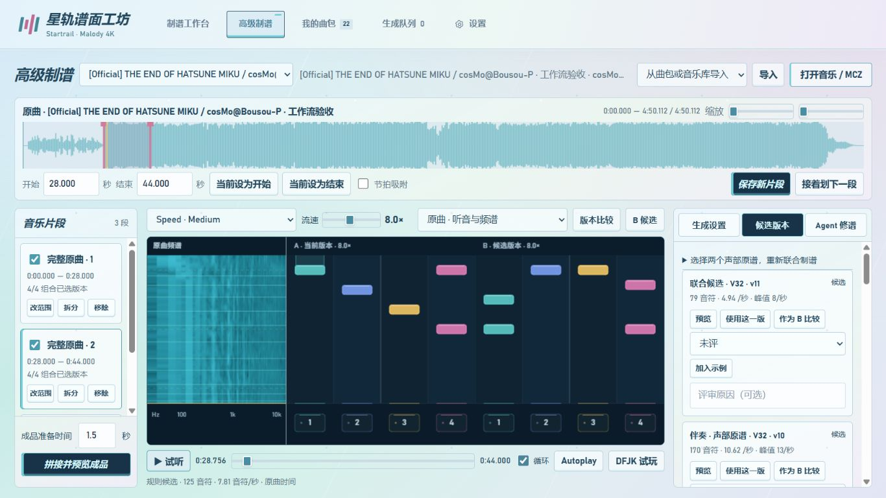
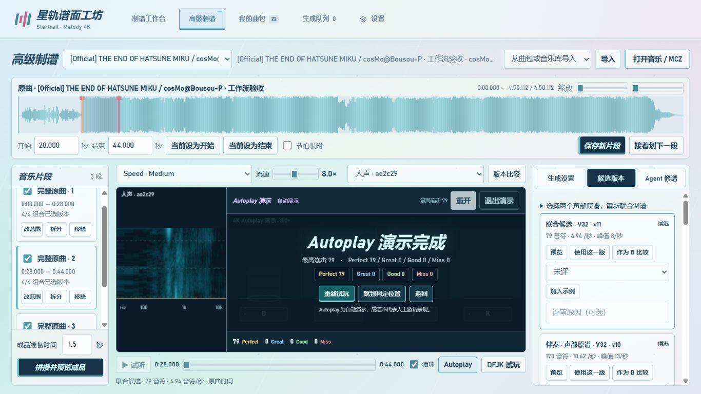

# 音频与制谱工作流验收记录

2026-10-03，本机 RTX 4080 SUPER。代码与模型功能已集成到正式页面。以下分开记录自动验证、真实模型推理与浏览器操作；没有把自动演示当作真人手感验收。

## 自动验证

后端 148 项、前端 39 项全部通过。覆盖源路径隔离、频谱时间投影与缓存、音乐互斥、加载与缓冲状态、Esc / Space、长条、Combo、结果操作、冻结计划、近时独立采音、声部分离完整性、联合排键与单次难度预算。

## 真实音频与模型

使用用户提供的《初音ミクの消失》曲包，原曲 290.112018 秒，重点片段 28–44 秒。原始项目与已选版本没有被新候选覆盖。

| 项目 | 实测结果 |
| --- | --- |
| Demucs 标准全曲分离 | 57.17 秒；两个声部均为 12,793,940 帧、44.1 kHz 双声道 FLOAT |
| 分离同步 | 28–44 秒声部之和与原曲相关峰偏移 0 sample；相关系数 0.99943 |
| V32 原混音独立 Medium | 24.406 秒；原谱 179 头，可玩规则候选 125 头 |
| V32 两声部与融合 | 42.875 秒，复用已分离缓存；人声 237 头、伴奏 170 头、融合 79 头 |
| MuG 动态快速分层 | 16 秒真实音频、50 步，10.891 秒；Easy / Medium / Hard 为 39 / 73 / 125 头 |
| 融合剪辑版导出 | 16 秒核心 + 1.5 秒准备，共 771,750 samples；79 头；MC 回读误差小于 1 ms |

融合输出采用原混音的 PCM，除切口防爆音淡变和准备静音外，核心音乐样本与原曲一致。实际 MCZ ZIP、`0/`、Vorbis 音轨、谱面结构及时间回读均通过检查。MuG 各档都只执行一次选键预算。

导入谱面中的 150→240 BPM 变化保留为参考。新版计划不把它当作已验证的音频结论；半倍速歧义时不增加 BPM 权重。高速细分通过声音活动和原模型事件参与生成、筛选，音符不强制吸附。

上述耗时仅代表本机本次运行，包含模型加载和处理阶段；分轨耗时不包含已缓存的全曲分离。详细本地记录为 `cache/workflow-generation-acceptance.json`、`cache/separation-acceptance.json`，不随仓库分发用户音频。

## 正式浏览器验收

- 真实片段试听进入 Autoplay 后，原试听暂停；整个页面同时只有游戏音乐播放。
- Esc 暂停后音频位置保持；Space 不继续游戏；Esc 继续倒计时后从原位置播放。
- 79 头融合候选完成 Autoplay，结算标明自动演示，四类判定、最高连击、重试与返回可操作。
- 频谱和 A/B 四轨使用同一投影。游戏中的频谱补偿工具栏高度，判定位置与游戏画布一致。
- 检查 1366×768、1440×900、1920×1080：没有新增页面横向或纵向滚动。
- 检查 390 px 窄屏：允许正常纵向浏览，A/B 单张切换；频谱与完整四轨高度一致，保留约 420 px 预览高度。

## 仍需人工判断

此次新曲包没有宣称已在手机 Malody 中完成导入与四指试玩。分离质量、节奏贴合、键型意图和局部难度仍需试听与真人比较；至少 20 组人工 A/B 的质量评估应继续通过高级台反馈功能记录。Demucs FT 没有列入本次真实分离验收。
